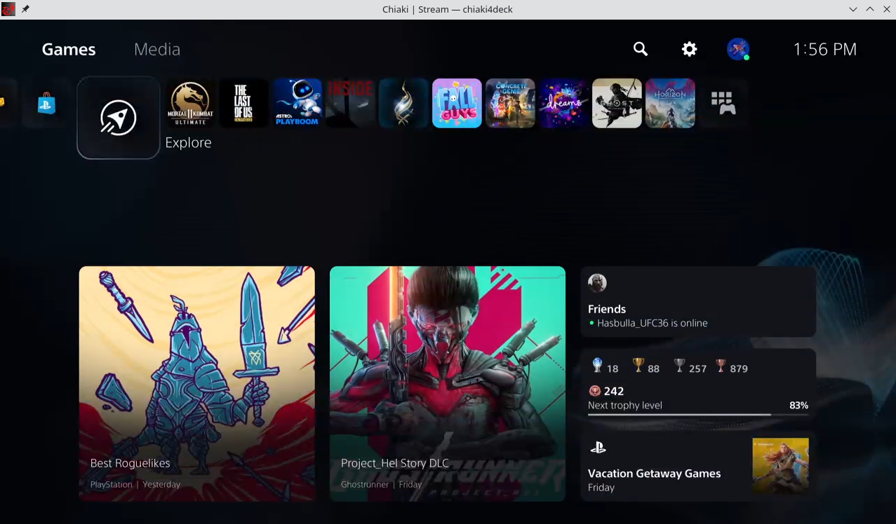

# Chiaki

**Disclaimer:** This project is not endorsed or certified by Sony Interactive Entertainment LLC.

[](https://ci.appveyor.com/project/thestr4ng3r/chiaki) [](https://builds.sr.ht/~thestr4ng3r/chiaki?)

Chiaki is a Free and Open Source Software Client for PlayStation 4 and PlayStation 5 Remote Play
for Linux, FreeBSD, OpenBSD, Android, macOS, Windows, Nintendo Switch and potentially even more platforms.



## Project Status

As all relevant features are implemented, this project is considered to be finished and in maintenance mode only.
No major updates are planned and contributions are only accepted in special cases.

## Installing

You can either download a pre-built release or build Chiaki from source.

### Downloading a Release

Builds are provided for Linux, Android, macOS, Nintendo Switch and Windows.

You can download them [here](https://git.sr.ht/~thestr4ng3r/chiaki/refs).

* **Linux**: The provided file is an [AppImage](https://appimage.org/). Simply make it executable (`chmod +x <file>.AppImage`) and run it.
* **Android**: Install from [Google Play](https://play.google.com/store/apps/details?id=com.metallic.chiaki), [F-Droid](https://f-droid.org/packages/com.metallic.chiaki/) or download the APK from Sourcehut.
* **macOS**: Drag the application from the `.dmg` into your Applications folder.
* **Windows**: Extract the `.zip` file and execute `chiaki.exe`.
* **Switch**: Download the `.nro` file and copy it into the `switch/` directory on your SD card.

### Building from Source

Dependencies are CMake, Qt 5 with QtMultimedia, QtOpenGL and QtSvg, FFMPEG (libavcodec with H264 is enough), libopus, OpenSSL 1.1, SDL 2,
protoc and the protobuf Python library (only used during compilation for Nanopb). Then, Chiaki builds just like any other CMake project:
```
git submodule update --init
mkdir build && cd build
cmake ..
make
```

For more detailed platform-specific instructions, see [doc/platform-build.md](doc/platform-build.md) or [switch/](./switch/README.md) for Nintendo Switch.

## Usage

If your Console is on your local network, is turned on or in standby mode and does not have Discovery explicitly disabled, Chiaki should find it.
Otherwise, you can add it manually.
To do so, click the "+" icon in the top right, and enter your Console's IP address.

You will then need to register your Console with Chiaki. You will need two more pieces of information to do this.

### Obtaining your PSN AccountID

Starting with PS4 7.0, it is necessary to use a so-called "AccountID" as opposed to the "Online-ID" for registration (streaming itself did not change).
This ID seems to be a unique identifier for a PSN Account and it can be obtained from the PSN after logging in using OAuth.
A Python 3 script which does this is provided in [scripts/psn-account-id.py](scripts/psn-account-id.py).
Simply run it in a terminal and follow the instructions. Once you know your ID, write it down. You will likely never have to do this process again.

### Obtaining a Registration PIN

To register a Console with a PIN, it must be put into registration mode. To do this on a PS4, simply go to:
Settings -> Remote Play -> Add Device, or on a PS5: Settings -> System -> Remote Play -> Link Device.

You can now double-click your Console in Chiaki's main window to start Remote Play.

## Acknowledgements

This project has only been made possible because of the following Open Source projects:
[Rizin](https://rizin.re),
[Cutter](https://cutter.re),
[Frida](https://www.frida.re) and
[x64dbg](https://x64dbg.com).

Also thanks to [delroth](https://github.com/delroth) for analyzing the registration and wakeup protocol,
[grill2010](https://github.com/grill2010) for analyzing the PSN's OAuth Login,
as well as a huge thank you to [FioraAeterna](https://github.com/FioraAeterna) for giving me some
extremely helpful information about FEC and error correction.

## About

Created by Florian Märkl

This program is free software: you can redistribute it and/or modify
it under the terms of the GNU Affero General Public License version 3
as published by the Free Software Foundation.

This program is distributed in the hope that it will be useful,
but WITHOUT ANY WARRANTY; without even the implied warranty of
MERCHANTABILITY or FITNESS FOR A PARTICULAR PURPOSE.  See the
GNU Affero General Public License for more details.

You should have received a copy of the GNU Affero General Public License
along with this program.  If not, see <https://www.gnu.org/licenses/>.

Additional permission under GNU AGPL version 3 section 7

If you modify this program, or any covered work, by linking or
combining it with the OpenSSL project's OpenSSL library (or a
modified version of that library), containing parts covered by the
terms of the OpenSSL or SSLeay licenses, the Free Software Foundation
grants you additional permission to convey the resulting work.
Corresponding Source for a non-source form of such a combination
shall include the source code for the parts of OpenSSL used as well
as that of the covered work.
