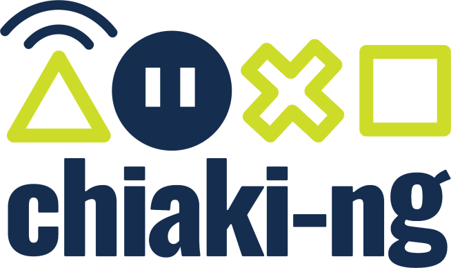
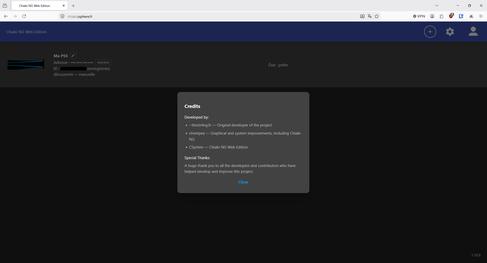
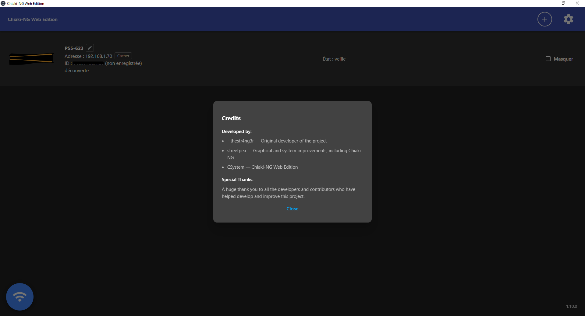
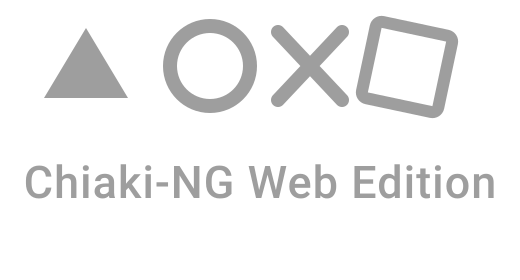
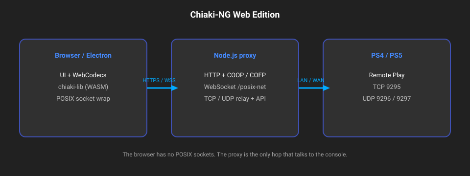

<p align="center">
  
</p>

# chiaki-ng - Web Edition

Open-source **PlayStation 4 / PlayStation 5 Remote Play** client. This tree is [chiaki-ng](https://streetpea.github.io/chiaki-ng/) plus a **browser** and **Electron** port: `chiaki-lib` runs as WebAssembly, POSIX TCP/UDP to the console goes through a **Node.js proxy**.

**Live demo:** [https://chiaki.csphere.fr/](https://chiaki.csphere.fr/)

The original Qt desktop, Android and Switch apps are unchanged. Web and Electron are additive.

This project is not endorsed or certified by Sony Interactive Entertainment LLC.

---

## Screenshots

<p align="center">
  <a href="https://chiaki.csphere.fr/"></a>
</p>

<p align="center"><em>Web client - <a href="https://chiaki.csphere.fr/">chiaki.csphere.fr</a></em></p>

<p align="center">
  
</p>

<p align="center"><em>Electron desktop app (Windows / Linux / macOS)</em></p>

<p align="center">
  
</p>

---

## Additions

| Area | What was added |
|---|---|
| **WASM client** | `chiaki-lib` compiled with Emscripten (`wasm/`, `build-wasm/`) |
| **Web UI** | `wasm/www/` - Material-style UI, WebCodecs H.264/H.265, AudioWorklet |
| **Node proxy** | `wasm/proxy/` - COOP/COEP static files + WebSocket POSIX relay + REST API |
| **Electron** | `wasm/electron/` - same stack in a local window (`.exe` / AppImage / `.dmg`) |
| **`.env`** | One config format for the server and for Electron (separate files) |
| **Auth** | Accounts, cookie sessions, SQLite - consoles and settings follow the user |
| **Stream share** | Viewer link (video, audio, physical gamepad, virtual pad) over WebRTC |
| **Keys & mouse** | Separate keyboard / mouse remaps, cursor lock, **F8** |
| **Virtual pad** | On-screen DualShock-style pad for phones |
| **i18n** | French and English (`wasm/www/i18n/`) |
| **Build scripts** | `scripts/build-wasm.*`, `scripts/build-electron.*`, `scripts/run-electron.*` |

## Modifications (vs stock chiaki-ng)

- CMake option `CHIAKI_ENABLE_WASM`: Qt GUI / CLI / tests off in the Emscripten cache only; a normal Qt build still uses a **separate** CMake directory (do not mix `emcmake` with the desktop tree).
- POSIX `socket` / `bind` / `select` / … are wrapped in `wasm/src/` and forwarded to Node over one WebSocket (`/posix-net`).
- Stream defaults in the web UI: **1080p**, **60 fps**, **15000 kbps**, H.265.
- Manual console add: IPv4 only, TCP **9295** checked first; PSN Account ID lookup via [psntools](https://www.psntools.com/).
- No PSN holepunch / Remote Play over PSN in the WASM build (LAN or public IPv4 + NAT).

French write-up: [`wasm/README_FR.md`](wasm/README_FR.md). English: [`wasm/README.md`](wasm/README.md).

---

## How the web version works

The browser cannot open POSIX sockets. The page loads the UI and `chiaki.wasm`. Node serves the files with **COOP/COEP** (required for `SharedArrayBuffer` / pthreads) and relays every socket call to the PS4/PS5.

<p align="center">
  
</p>

**Electron** is the same binary and UI, with the proxy bound to `127.0.0.1` only (default port **18780**). It does **not** replace the hosted web server and does **not** read the SERVER `.env` (it uses a file in the user profile).

### Ports

**Machine that runs Node** (server / PC):

| Port | Usage |
|---|---|
| `CHIAKI_WASM_PORT` (default **8080**, example **8090**) TCP | HTTP(S) + WebSocket UI and posix-net |
| **443** TCP | Public HTTPS (e.g. [chiaki.csphere.fr](https://chiaki.csphere.fr/)) behind nginx |

Outside `localhost`, WASM pthreads need **HTTPS**.

**Router / console** (Remote Play, IPv4):

| Port | Proto | Role |
|---|---|---|
| **9295** | TCP | Remote Play session (tested before adding a host) |
| **9296** / **9297** | UDP | Video / audio stream |
| **987** | UDP | PS4 discovery (LAN) |
| **9302** | UDP | PS5 discovery (LAN) |

### `.env` (server)

Copy [`.env.example`](.env.example) to `.env` at the repo root:

```env
CHIAKI_AUTH_ENABLED=true
CHIAKI_AUTH_ALLOW_REGISTER=true
CHIAKI_ADMIN_USER=
CHIAKI_ADMIN_EMAIL=
CHIAKI_ADMIN_PASSWORD=
CHIAKI_DB_DIR=./db
CHIAKI_DB_NAME=chiaki.sqlite
CHIAKI_SESSION_DAYS=30
CHIAKI_SESSION_SECRET=change-me
CHIAKI_MAX_HOSTS=32
CHIAKI_WASM_PORT=8090
```

Electron: `%AppData%/Chiaki-NG Web/.env` on Windows - not the server file. Auth is off by default in the exe.

---

## Build: web (WASM)

Always from the **repository root**.

```bash
git submodule update --init --recursive
```

Install once: [Emscripten](https://emscripten.org/docs/getting_started/downloads.html), CMake, Ninja, Python 3, Node.js ≥ 18.

`.\scripts\build-wasm.ps1` downloads **protoc 3.9.1** into `tools/protoc/` if missing, and creates `tools/wasm-python` (protobuf **4.25.3**) so nanopb works with Python 3.13.

**Windows**

```powershell
.\scripts\build-wasm.ps1
node wasm/proxy/server.mjs
```

Open http://127.0.0.1:8080/ (or the port in `.env`).

**Linux**

```bash
source ~/emsdk/emsdk_env.sh
chmod +x scripts/build-wasm.sh
./scripts/build-wasm.sh
node wasm/proxy/server.mjs
```

Output: `build-wasm/wasm/` (`chiaki.wasm`, `chiaki.js`, copied UI and proxy).

Full install notes: [`wasm/Build_WASM.md`](wasm/Build_WASM.md) · [`wasm/Build_WASM_FR.md`](wasm/Build_WASM_FR.md)

---

## Build: Electron

Requires **WASM already built** (`build-wasm/wasm/chiaki.wasm`). Pack on the **target OS**.

**Windows**

```powershell
.\scripts\build-wasm.ps1
.\scripts\build-electron.ps1
```

Output: `wasm/build/pack-…/win-unpacked/chiaki-ng-web.exe`

Dev window (no installer):

```powershell
.\scripts\run-electron.ps1
```

**Linux**

```bash
source ~/emsdk/emsdk_env.sh
./scripts/build-wasm.sh
chmod +x scripts/build-electron.sh scripts/run-electron.sh
./scripts/build-electron.sh
```

**macOS:** `./scripts/build-electron.sh mac`

| Script | Role |
|---|---|
| `scripts/build-wasm.ps1` / `.sh` | Configure Emscripten + compile `chiaki-wasm` |
| `scripts/run-electron.ps1` / `.sh` | Dev: start Electron against the local WASM build |
| `scripts/build-electron.ps1` / `.sh` | Package `.exe` / AppImage / mac app into `wasm/build/` |

---

## Limits (WASM)

- No Remote Play via PSN / holepunch
- IPv4 only
- Chrome / Edge / Firefox recent (WebCodecs + SharedArrayBuffer)
- HTTPS required off localhost

---

## Desktop / other platforms (chiaki-ng)

Qt, Android, Switch and documentation for the classic clients: [streetpea.github.io/chiaki-ng](https://streetpea.github.io/chiaki-ng/).

Community Discord: [discord.gg/tAMbRuwXDH](https://discord.gg/tAMbRuwXDH)

---

## Credits

- **~thestr4ng3r** - original Chiaki
- **streetpea** - chiaki-ng
- **CSystem** - Chiaki-NG Web Edition ([chiaki.csphere.fr](https://chiaki.csphere.fr/))
