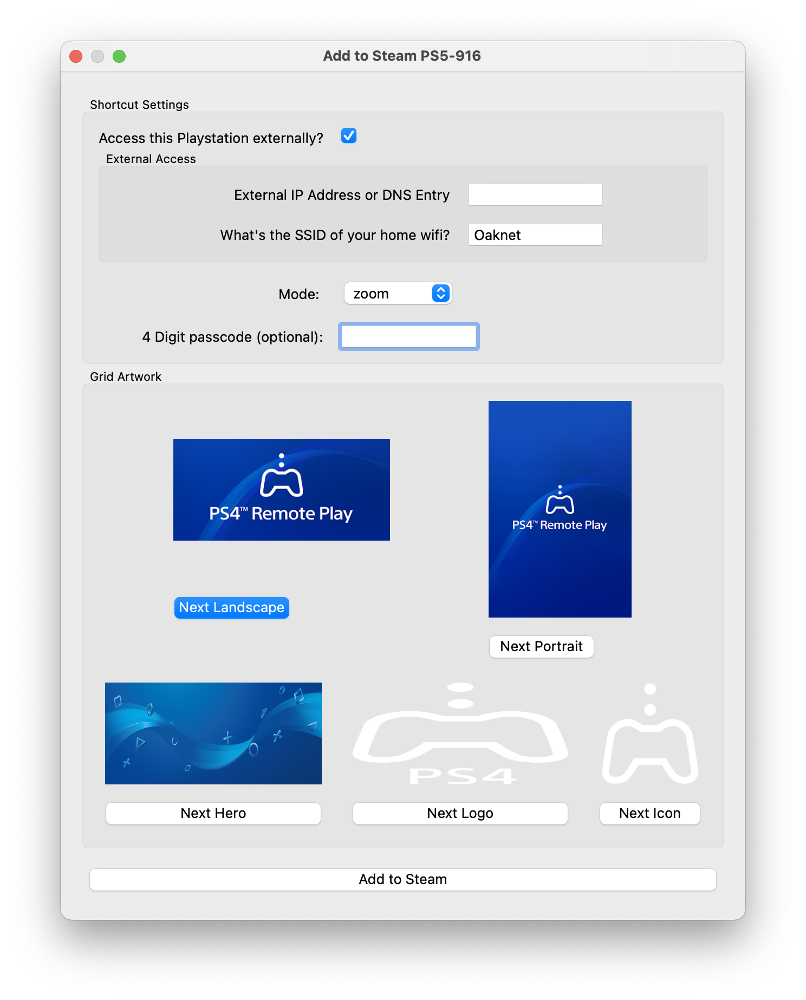

# Automating `chiaki4deck` Launch

Now that you have `chiaki4deck` configured, it's time to make it wake up your PlayStation and connect to it automatically. 

!!! Info "So Why Should I Care?"

    This is especially convenient for the Steam Deck's `Game Mode` where an automated launch eliminates both the need to tap furiously at your touchscreen to launch the application and the glitches that would arise (flashes on your screen) when it would switch between the 2 open Chiaki windows (since only 1 window is opened with the automated launch). It also gives a default game mode option to launch in fullscreen, stretch or zoomed mode, making it [easier to use the 3 games modes](../updates/done.md#3-view-modes-for-non-standard-screen-sizes){target="_blank" rel="noopener"}. Finally, it allows for passing your login passcode automatically instead of manually typing in each time (for those of you with a login passcode set on your PlayStation console).

!!! Warning "Sleep Mode Required"

    For this to work, your PlayStation needs to either be in rest/sleep mode or on (so that it is listening for the wake up signal). This means you will want to keep your PlayStation in rest/sleep mode when you are not playing (instead of off).

1. Open up `chiaki4deck` and ensure your console is registered.
2. Right click (Left Trigger) on your console and select `Add to Steam`
    
3. Fill in the `Shortcut Settings` portion of the popup
    

    !!! Question "What Do the Different Modes (i.e., fullscreen [uses Normal], zoom, stretch) Look Like?"

        To see examples of the different launch modes, visit the [Updates section](../updates/done.md#3-view-modes-for-non-standard-screen-sizes){target="_blank" rel="noopener"}

    !!! Tip "Connecting Outside of Your Local Network"

        You can add an external IP or hostname in addition to your local one to connect from an external network. To do so, you need to set up port forwarding as detailed in the prior [remote connection section](remoteconnection.md){target="_blank" rel="noopener"}. Then, you can choose to setup an external IP/hostname. The automation will take your home network name (SSID) to check if you are home or not to use the correct IP/hostname automatically. The script will automatically detect your current SSID. Thus, if you are on your home network while running this step, it will detect your home ssid so you will not need to alter this. If not, you can enter ot manually (instead of using the default of your Steam Deck's current network's SSID). You can get your home SSID for manual entry via `iwgetid -r` from the `konsole` when connected to your home network or by looking in your network history on your Steam Deck (it will be the connection name for your home network such as `StreetPea-5G`). Of course, if you want to skip this now and setup the external address later, you can always leave this unticked and update it later

4. Select the artwork you want to use for steam
5. Click `Add to Steam`        
6. Test your newly created script (if you haven't already) by Starting your new Steam shortcut:

    === "Your script worked!"
    
        !!! success "We have liftoff! :rocket:"

            Chiaki launched in your desired screen mode on your Steam Deck! Congratulations!

    === "Your script didn't work..."

        !!! Failure "You are no longer on the happy path :weary:"

            === "Script fails before launching stream window"

                Check the error message and fix issues if obvious. Otherwise, things to check:
                
                1. Make sure your PlayStation console is in either rest/sleep mode or on (otherwise this won't work)
                
                2. Double check the values you entered in the script to make sure they are correct.
                
                3. Open your script at: `/home/deck/.var/app/io.github.streetpea.Chiaki4deck/config/Chiaki/<My Console NickName>.sh` and try to run each command individually to see what's causing your problem.
                
                4. If issues persist with this and `chiaki4deck` launches fine regularly via the application link, just not the automation, feel free to reach out. If you think the documentation itself needs to be updated click the :material-heart-broken: underneath "Was this page helpful?" and open the feedback form for this page. If you just need help, you can reach me via [Reddit](https://www.reddit.com/message/compose/?to=Street_Pea_6693){target="_blank" rel="noopener"} or [email](mailto:streetpea@proton.me)

            === "Error in stream window"
 
                Close `chiaki4deck` gracefully by closing any open dialog boxes and then using ++ctrl+q++ on the stream window. If `chiaki4deck` doesn't close gracefully, move your mouse to the top left corner of the stream window and a blue circle should highlight the corner of the screen. Click on it to see all of your windows and select the `konsole` window. Then, close the `konsole` window itself (click its `x` icon in the top right corner). Next, you can relaunch the script again to make sure it wasn't a one-time snafu. Note: Chiaki seems to perform better (audio/visual quality) in `Game Mode` vs. `Desktop Mode` for me. If issues persist, feel free to reach out via [Reddit](https://www.reddit.com/message/compose/?to=Street_Pea_6693){target="_blank" rel="noopener"} or [email](mailto:streetpea@proton.me). If you think the documentation itself needs to be updated click the :material-heart-broken: underneath "Was this page helpful?" and open the feedback form for this page.