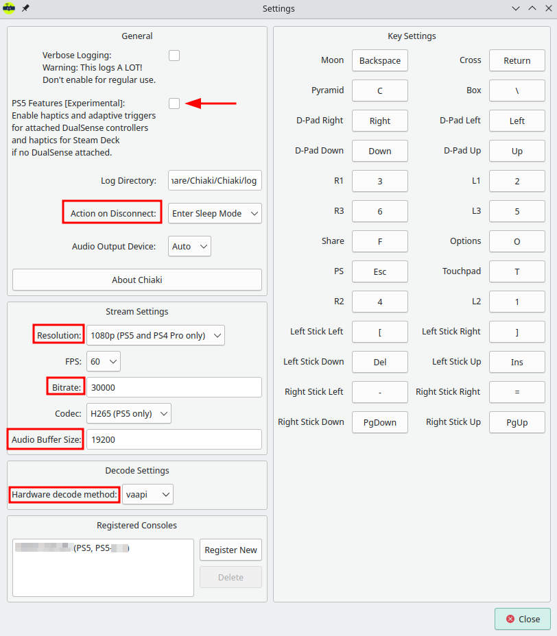
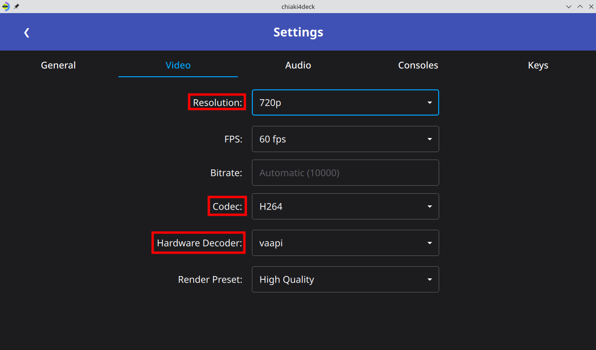

# Configuring `chiaki4deck`

## Registering your PlayStation

=== "Upgrading from Using Chiaki Flatpak on Steam Deck"

    !!! Tip "Make sure you're on the right tab!"
    
        If you haven't set up the Chiaki flatpak on Steam Deck, please switch to the **New to Using Chiaki on Steam Deck Tab.** If you have set up the official Chiaki flatpak and want to try `chiaki4deck`, you're in the right place! :tada:

    1. Create initial file templates for `chiaki4deck`

        1. Open `chiaki4deck` by clicking the Steam icon in the bottom left and searching for it in the `Games` section via the graphical user interface (GUI) or by entering `flatpak run re.chiaki.Chiaki4deck` in the `konsole`

        2. Close `chiaki4deck`

    2. Copy your configuration file from the Chiaki flatpak with the following `konsole` command

        ``` bash
        cp ~/.var/app/re.chiaki.Chiaki/config/Chiaki/Chiaki.conf ~/.var/app/re.chiaki.Chiaki4deck/config/Chiaki/Chiaki.conf
        ```

    3. Open `chiaki4deck` again and you should see your registered console and settings from Chiaki now copied to `chiaki4deck`.

        !!! Question "What Did I Just Do?"

            You just replaced the config file (flatpak stores config files for each app in `~/.var/app/appid/config` where `appid` is your app's appid) for `chiaki4deck` (which doesn't have your details yet) with the one for Chiaki (which you already went through the registration process and configured settings for) so that you don't have to go back through the same process with `chiaki4deck` and can start using it as quickly as possible.

=== "New to Using Chiaki on Steam Deck"

    1. Get your PlayStation AccountID (This is needed to access your ps account)

        1. Run the flatpak with the `psn-account-id` command

            ``` bash
            flatpak run --command=psn-account-id re.chiaki.Chiaki4deck
            ```

        2. Follow the prompts, opening a browser and logging in with your PlayStation network account details when prompted.

        3. Copy the Account-ID you receive and store it in a safe place. This is the Account-ID used for remote play that is associated with your PlayStation online account username and password.

    2. Open `chiaki4deck` (click the Steam icon in the bottom left and search for it in the `Games` section via GUI or `flatpak run re.chiaki.Chiaki4deck` via `konsole`) and your PlayStation system should be automatically discovered.

        

        !!! Question "What if my PlayStation Console isn't Appearing?"
        
            Make sure your Steam Deck is on the same wireless network as your PlayStation system and that the PlayStation console is either on or in sleep/rest mode. If this doesn't work, you can always try restarting your Steam Deck and connecting to the network again.

    3. Register your PlayStation console

        1. Double click on the blue box to bring up a registration window

            

        2. Choose your console type

        3. Enter your PSN Account-ID obtained in step 1 above.

        4. Get a registration code for remote play

            === "PS5"

                Go to `Settings -> System -> Remote Play -> Link Device`

            === "PS4"

                Go to `Settings -> Remote Play -> Add Device`

        5. Enter the code from your device in the `PIN` field

        6. Click Register (will become available when all necessary fields are filled)

    4. You should see this upon successful registration

        

    5. Click out of the dialog boxes and see that your console now shows registered

        

## Testing your Connection

!!! Bug "Steam Deck Speaker Fails to Load, Crashing Official Chiaki and `chiaki4deck` in Desktop Mode"

    In Desktop Mode, the Steam Deck speaker (Raven) can fail to load on startup. This is rare but seems to happen every once in a while. Unfortunately, this reliably crashes Chiaki and by inheritance `chiaki4deck`, causing it to hang indefinitely. The only ways to exit Chiaki are to close the `konsole` window that launched it (if launched via automation), forcibly kill the process (`kill -9`) or forcibly shutoff the Steam Deck. I am working on a way to prevent this from crashing Chiaki in a bugfix (and hopefully :fingers_crossed: someone is working on the underlying Steam Deck speaker driver issue causing this). In the meantime, **there are 2 good workarounds that prevent this from occurring** (either one works). Please use one of the following when using Chiaki or `chiaki4deck`:
    
    - After booting into Desktop Mode, adjust the volume of the Steam Deck (hit the + or -) volume button (only needs to be done once per boot). You will see this cause Raven to load if it hasn't already. Now, you are safe to launch either Chiaki or `chiaki4deck` at any time until you turn off your Steam Deck.

        **OR**

    - Use `chiaki4deck` and/or `Chiaki` in Game Mode when possible; the speaker not loading hardware error doesn't occur there.

Launch the connection to test it by opening `chiaki4deck` and double clicking on the box with the console icon. You can even test launching a game if you want. Exit out of the window once you've tested the connection.

=== "It worked! :smile:"

    !!! success "Purrfect :cat:"

        You were able to launch your stream and connect. Maybe, you even got a game running.

        

=== "It didn't work :frowning:"

    !!! Error "An error occurred"

        1. Please try closing and re-launching to make sure it wasn't some sort of temporary snafu (maybe your console was updating something and didn't want to let you connect right away)

        2. Make sure your PlayStation shows as registered and is currently either on or in sleep mode. If it's not on or in sleep mode, you can't connect to it.

## Choosing your Remote Play Settings

Here are different settings you can use for Chiaki/`chiaki4deck` depending on your network connection. The default configuration is for remote play on a home network only, this means that it is dependent only on the performance / strength of your wireless router (or ethernet connection) [recommended to connect the PlayStation console via ethernet and Steam Deck via wi-fi to optimize performance and portability] and not on your Internet (World Wide Web) connection. 

!!! Question "What does that mean for me?"

    If you are in an area with bad Internet, as long as you have a good wireless router, you can get close to native performance.

1. Open `chiaki4deck` and click the gear icon in the top right to open the settings menu

    

2. Adjust the settings to your preferences. Below are the settings you'll want to try first with your PlayStation console (choose the **PS5/1080p** tab if you have a PS5 or the **PS4/720p** if you have a PS4). If you are having issues with your PS5 connection, please try the **PS4/720p** settings with your PS5 since they require significantly less bandwidth from your wireless router.

    === "PS5/1080P"

        Stream output can be up to 1080p. Here are the settings that are currently working well for me. This results in a native-like experience for most games on my network/setup.

        

        ???+ Question "Why 1080p if the Steam Deck is only 800p?"

            Using 1080p results in a better picture for me than 720p. The biggest factor in this seems to be [chroma-sub sampling](https://www.phonearena.com/news/Did-you-know-4K-vs-1080p-chroma-sub-sampling-and-why-you-should-record-in-4K-even-if-your-TV-does-not-support-it-yet_id61878){target="_blank" rel="noopener noreferrer"}. In simple terms, the colors for an image are compressed and so you get a much lower resolution of color data than your image resolution. This means a 1080p image (with a high bitrate) will have more color data than a 720p image even if the image resolution itself ends up being 720p (since the color resolution will be higher than the equivalent 720p picture's color resolution). This results in an image that has more pop to it. Thus, I recommend streaming at 1080p if you have the bandwidth (good enough wireless router).
            
            However, if you are having issues with your wireless connection (i.e choppy audio, flashes in your video, or lag) while playing, then please use 720p instead. The gains you get from 1080p are nice, but aren't worth having a bad connection.

    === "PS4/720P"

        For PS4, the stream is limited to 720p. Using the defaults for most values works well here, resulting in native-like (albeit w/ a diminished resolution) experience for most games on my network/setup.

        

    !!! Tip "Putting your PlayStation Console to Sleep Automatically"

        For `Action on Disconnect`, choose `Enter Sleep Mode` to automatically put your PlayStation console to sleep as soon as you close your session with ++ctrl+q++ (you will add this shortcut as part of you controller configuration in [controller section](controlling.md){target="_blank" rel="noopener noreferrer"}). 
        
        If you prefer, you can also use `Ask` (the default) to get prompted about putting your PlayStation to sleep when you close your session (use ++ctrl+q++).

## Performance of Chiaki/`chiaki4deck`

### My Experience

Ultimately, the performance will depend on the capability of your wireless router and which system ($PS5 > PS4 Pro > PS4$) you are using. Here are some notes from my experience using `chiaki4deck` on my Steam Deck with a PS5 console and a relatively good ($450 Mbps$ for $2.4GHz$ / $1,300 Mbps$ for $5GHz$) wireless router.

!!! Example "My Wireless Connection by the Numbers"

    I'm using the $5GHz$ band for `chiaki4deck` on my Steam Deck, meaning the total bandwidth for all devices on my local network is $1,300 Mbps$ (remember Internet connection itself doesn't matter since we're only using our wireless router for local streaming). Since I am using the settings in [Choosing Your Remote Play Settings](#choosing-your-remote-play-settings), I'm using $(30,000 + 19,200) Kbps \approx 50 Mbps$ out of the total of $1,300 Mbps$. This means I'm using about $4\%$ of my $5GHz$ band. In other words, I still have plenty of bandwidth for watching Netflix :zany_face: while I play on my Steam Deck!

!!! Question "What Performance Can I Expect?"

    I am currently getting close to native performance using `chiaki4deck` on my Steam Deck with my PS5. This gives me better performance than I get playing performance heavy games directly on Steam Deck (like that one game where the kid gets bit by a :spider:)

    Benefits:

    - 5-6 hours of battery life (vs 1-2 hours playing the same games natively on Steam Deck)
    - access to PlayStation collection (games I have already purchased or have via PS Plus) including exclusives
    - Steam Deck quiet as a mouse (especially important when playing while watching a show with others)
    - PlayStation Trophies

    Negatives:

    - occasional performance issues with certain games (specifically games with VSync enabled)
    - lack of touchpad gesture and gyro controls for games that require these
    - lack of native microphone support (I use Discord with my friends so not an issue for me, but could be for others).

!!! example "Games I've Played Successfully Using `chiaki4deck` So Far..."

    - Stray
    - God of War (2018)
    - Genshin Impact (turned off VSync in settings to get rid of white flashes during gameplay)
    - Sekiro (occasional white flashes in areas with high crowds. These went away as I got further in the game and never affected my ability to progress. Unfortunately, this seems to be due to VSync being enabled automatically with no option to turn it off. Luckily, the framerate is very solid on PS5 so it happens infrequently (at its peak there was 1 flash every 15 minutes. It only affected about 3 hours of the game in total.)
    - Fall Guys
    - MultiVersus
    - Red Dead Redemption 2
    - Marvel's Spider Man

### Troubleshooting Performance Issues

!!! Example "Examples of performance issues"

    - white flashes
    - green flashes
    - audio choppiness/crackling
    - excessive lag 

To fix these issues, try the following:

1. If you are not using the settings listed in [Choosing Your Remote Play Settings](#choosing-your-remote-play-settings), try with those settings and see if that fixes it for you.

2. Switch to **720p** from 1080p

    **720p** requires less bandwidth than 1080p. This help if your wireless connection is the problem, especially since it's very easy to do. This can fix video artifacts (white / green flashes) and audio choppiness (both results of connection problems).

3. Try **short preamble**

    If you are still having trouble (I didn’t need this but it can help in general and helped significantly improve performance for other streaming services such as Game Pass on my Steam Deck), try using using [short preamble instead of long preamble](https://www.interline.pl/Information-and-Tips/Preamble-Type-Short-Or-Long){target="_blank" rel="noopener noreferrer"} in your router settings. You need to change this directly in your router settings for the given network and can do it per network if you set up more than one. This is incompatible with old devices (using wifi b/g instead of n or ac). Devices from 2011 and newer are required by law to support it and so will definitely work. Older devices may or may not support it depending on if they have either n or ac wireless support. Short preamble helps the $5GHz$ connection for devices that support it (essentially anything that’s connecting on a $5GHz$ network should use it). For streaming, you can set up one network that uses short for your newer devices ($5GHz$ network for me) and one with long for older devices ($2.4 GHz$ network for me since older devices don’t support $5GHz$ anyway). My connection worked fine with long preamble on a $2.4 GHz$ network for Chiaki but short (and a $5GHz$ network for that matter) works better in general for devices that support it and has helped others using Chiaki as well as me to help reduce Game Pass streaming lag (which is still much worse than Chiaki and not close to native, but works well for games that don’t require fast or moderately fast reaction times).

4. **Turn off VSync** or the equivalent in games that use it
    
    VSync should only be enabled on the client side while streaming and having it enabled in the game itself can cause issues since it requires some extra overhead and can't actually sync with your screen if you're streaming the game. This resulted in issues with white flashes for me while playing Genshin Impact and Sekiro. When I turned off VSync in the Genshin Impact settings, these flashes (which had happened multiple times a minute with VSync on) disappeared. This affects only a small number of games, but is something to watch out for if you randomly have an issue with one game while others run well with Chiaki/`chiaki4deck`.

## Chiaki/`chiaki4deck` via Internet (Outside of Home Connection)

!!! Info "Chiaki/`chiaki4deck` Outside of your Home Network"
    
    You can also open up ports to connect from the Internet, but the performance will not be as good, with increased input lag being the most noticeable downgrade. In this scenario, your connection will depend on both the Internet connection of your PlayStation console via the router and the Internet connection of your computer via your location (internet speeds themselves will apply). The farther away (more hops from your router) you get, the worse the performance will get. If you are still in the same state, it will likely still be relatively good. However, if you go cross-country or something like that, it can degrade significantly.