# Configuring `chiaki-ng`

## Registering your PlayStation

=== "New to Using Chiaki/chiaki-ng"

    1. Set up your PlayStation console for remote play

        1. Enable remote play

            === "PS5"

                Go to `Settings -> System -> Remote Play` and turn on:

                1. `Enable Remote Play`

            === "PS4"

                1. Go to `Settings -> Remote Play Connection Settings` and turn on:
                
                    1. `Enable Remote Play`

                2. Go to `Settings -> Account Management -> Activate as Your Primary PS4` and select:

                    1. `Activate`

        2. Enable waking your console from rest mode

            === "PS5"

                Go to `Settings -> System -> Power Saving -> Features Available in Rest Mode` and turn on:

                1. `Stay Connected to the Internet`
                2. `Enable Turning on PS5 from Network`

            === "PS4"

                Go to `Settings -> Power Save Settings -> Set Function Available in Rest Mode` and turn on:
                
                1. `Stay Connected to the Internet`

                2. `Enable turning on PS4 from Network`

    2. Open `chiaki-ng` (click the Steam icon in the bottom left and search for it in the `Games` section via GUI or `flatpak run io.github.streetpea.Chiaki4deck` via `konsole`) and your PlayStation system should be automatically discovered.

        

        !!! Question "What if my PlayStation Console isn't Appearing?"
        
            Make sure your client device (i.e., Steam Deck) is on the same wireless network as your PlayStation system and that the PlayStation console is either on or in sleep/rest mode. If this doesn't work, you can always try restarting your client device (i.e., Steam Deck) and connecting to the network again. If it still doesn't work you can try the Manual Registration step in step 5 below.

    3. Register `chiaki-ng` with PSN to enable remote Play via PSN via the popup

        

        1. Login to psn on the provided page if one appears. Otherwise, paste your clipboard contents in a web browser and bang enter to bring up the login to psn page.

            ???- Tip "Tips for those having trouble logging into to PSN"

                If you get a `connection to the server timed out` message, keep on trying to login by hitting ++enter++ every few seconds until you get a different error message such as `Can't connect to the server` or you have tried for at least 20 seconds. If that doesn't work, please try refreshing the page and going through the process again. If you still can't find success, make an attempt using a different browser.

                Unfortunately, we have no control over Sony's site (that gives out auth tokens to access their PSN servers for the remote connection over PSN setup) so we can only give tips on how best to handle the errors that may occur on the page and wish you the best in obtaining your token. Fortunately, once this token is obtained, chiaki-ng will automatically refresh it as needed and only ask for you to create a new token in the event that PSN requires you to generate a new one using your login.

        2. Copy your redirect url from the browser

            

        3. Paste your redirect url on the page and create your token

            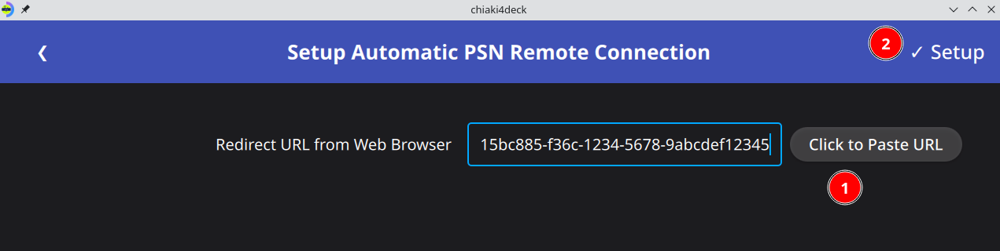

        4. See success message and close the dialog box

            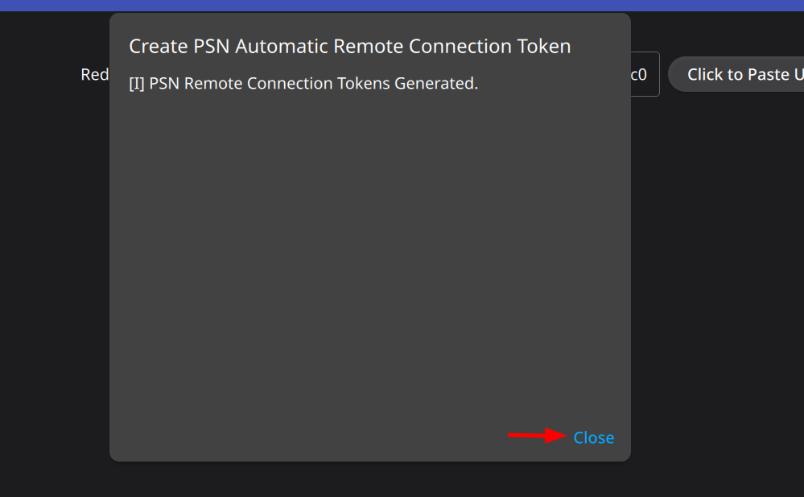

            !!! Danger "Error Message"

                If you obtain an error with a link to Sony's oauth site, it is likely the code from the link has expired and you need to create a new code by logging in again and pasting the url into chiaki-ng. The code usually expires within a few minutes. Otherwise, the error code should hopefully be self explanatory.

    4. Register your PlayStation console

        === "Register Discovered Console (Recommended)"

            === "Automatic (pinless) Registration"

                1. Make sure you have registered `chiaki-ng` with PSN following the previous step.

                2. Click on the pane of the console you want to register that includes the label *Automatic Registration Available*

                    

                3. Select yes in the dialog box asking if you would like to use automatic registration

                    

                4. Wait for the console to be successfully registered and then see your registered console in the main menu

                    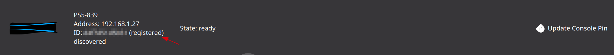

            === "Registration via Pin"

                1. [Only if registered via PSN] If registered with PSN, select no to the dialog box asking if you would like to use automatic registration

                    

                2. Click on the pane of the console you want to register to bring up a registration window or a dialog box asking if you want to use automatic reg

                    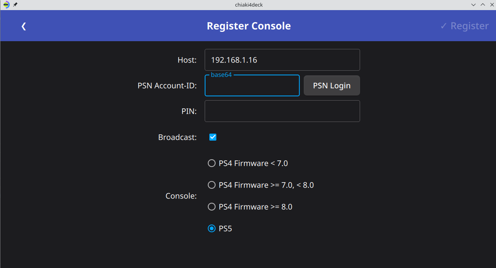

                3. Choose your console type

                4. If you registered for remote connection via PSN your `PSN Account-ID` will be automatically entered. Otherwise, either use PSN via the `PSN Login` button or public lookup using the `Public Lookup` button to obtain your `PSN Account-ID`.

                5. Get a registration code for remote play

                    === "PS5"

                        Go to `Settings -> System -> Remote Play -> Link Device`

                    === "PS4"

                        Go to `Settings -> Remote Play -> Add Device`

                6. Enter the code from your device in the `Remote Play PIN` field

                7. (Optional) If you have a pin for your console, enter it in the `Console Pin` field to have `chiaki-ng` automatically enter your PIN instead of having to enter it manually each time.

                8. Click Register (will become available when all necessary fields are filled)

        === "Register By IP (for undiscoverable consoles)"

            1. Click the gear icon in the top right to go to `Settings`

            2. Click the `consoles` tab

            3. Click the blue `Register New` button to bring up a registration window

                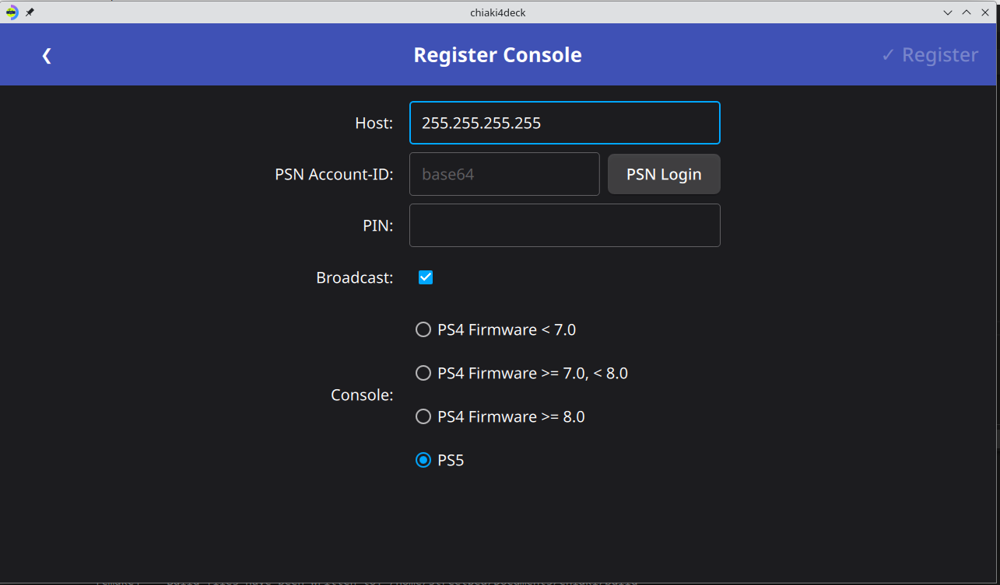

            4. Enter your PlayStation's ip address in the `Host` section replacing `255.255.255.255`

                You can obtain your PlayStation's ip address by going in your PlayStation console's settings and going to:

                === "PS5"

                    `System->System Software->Console Information` and looking at the IPV4 Address

                === "PS4"

                    `Network->View Connection Status` and looking at the IP Address.

            5. Choose your console type

            6. Enter your PSN Account-ID obtained in step 1 above (if not automatically copied).

            7. Get a registration code for remote play

                === "PS5"

                    Go to `Settings -> System -> Remote Play -> Link Device`

                === "PS4"

                    Go to `Settings -> Remote Play -> Add Device`

            8. Enter the code from your device in the `PIN` field

            9. Click Register (will become available when all necessary fields are filled)

    6. You should see this upon successful registration

        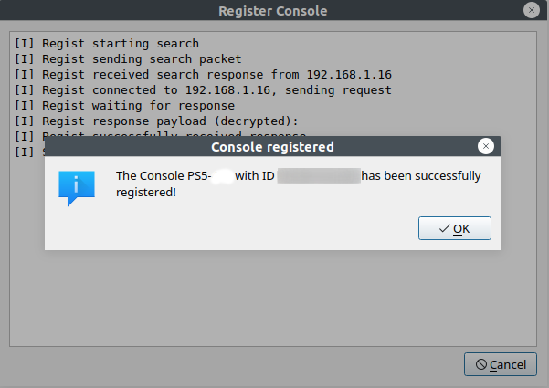

    7. Click out of the dialog boxes and see that your console now shows registered

        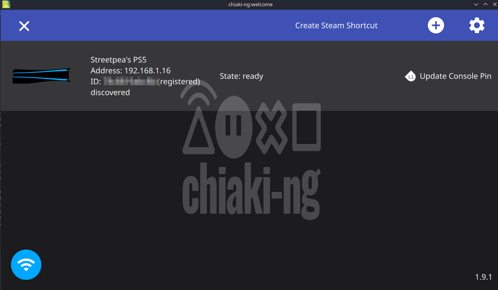

=== "Upgrading from Using Chiaki Flatpak"

    !!! Tip "Make sure you're on the right tab!"
    
        If you haven't set up the Chiaki flatpak on your client device [i.e., Steam Deck], please switch to the **New to Using Chiaki/chiaki-ng Tab.** If you have set up the official Chiaki flatpak before (no, you don't have to uninstall `Chiaki` :wink:) and want to try `chiaki-ng`, you're in the right place! :tada:

    1. Create initial file templates for `chiaki-ng`

        1. Open `chiaki-ng` by clicking the Steam icon in the bottom left and searching for it in the `Games` section via the graphical user interface (GUI) or by entering `flatpak run io.github.streetpea.chiaki-ng` in the `konsole`.

            !!! Question "What if chiaki-ng doesn't appear in the `Games` section?"

                If `chiaki-ng` doesn't appear in the `Games` section, go to `All Applications` and search for `chiaki-ng` there. It should show up in the `Games` section, but I've noticed that sometimes it only shows up in its appropriate section after a restart. Going to `All Applications` works in all cases.

        2. Close `chiaki-ng`

    2. Copy your configuration file from the Chiaki flatpak with the following `konsole` command

        ``` bash
        cp ~/.var/app/re.chiaki.Chiaki/config/Chiaki/Chiaki.conf ~/.var/app/io.github.streetpea.Chiaki4deck/config/Chiaki/Chiaki.conf
        ```

    3. Open `chiaki-ng` again and you should see your registered console and settings from Chiaki now copied to `chiaki-ng`.

        !!! Question "What Did I Just Do?"

            You just replaced the config file (flatpak stores config files for each app in `~/.var/app/appid/config` where `appid` is your app's appid) for `chiaki-ng` (which doesn't have your details yet) with the one for Chiaki (which you already went through the registration process and configured settings for) so that you don't have to go back through the same process with `chiaki-ng` and can start using it as quickly as possible.

## Testing your Connection

1. Test waking your console from rest mode

    1. Put your console in rest mode

    2. Open `chiaki-ng`

    3. Your PlayStation console should be discovered display (**State: ready** or **State: standby**).

2. Test PlayStation Remote Play

    1. Press/click on your registered console
    
    2. Test launching a game if you want
    
    3. Exit out of the window once you've tested the connection.

    === "It worked! :smile:"

        !!! success "Purrfect :cat:"

            You were able to launch your stream and connect. Maybe, you even got a game running.

            

    === "It didn't work :frowning:"

        !!! Failure "An error occurred"

            1. Please try closing and re-launching to make sure it wasn't some sort of temporary snafu (maybe your console was updating something and didn't want to let you connect right away).

            2. Make sure your PlayStation appears in the Chiaki menu, is labelled **(registered)** and is animated with either an orange (**State: standby**) or blue (**State: ready**) light.

## Choosing your Remote Play Settings

Here are different settings you can use for Chiaki/`chiaki-ng` depending on your network connection. The default configuration is for remote play on a home network only. This means that it is dependent only on the performance / strength of your wireless router (or ethernet connection) [recommended to connect the PlayStation console via ethernet and Steam Deck via wi-fi to optimize performance and portability] and not on your Internet (World Wide Web) connection.

!!! Question "What does that mean for me?"

    If you are in an area with bad Internet, as long as you have a good wireless router, you can get close to native performance.

1. Open `chiaki-ng` and click the gear icon in the top right or the options button on your controller to open the settings menu

    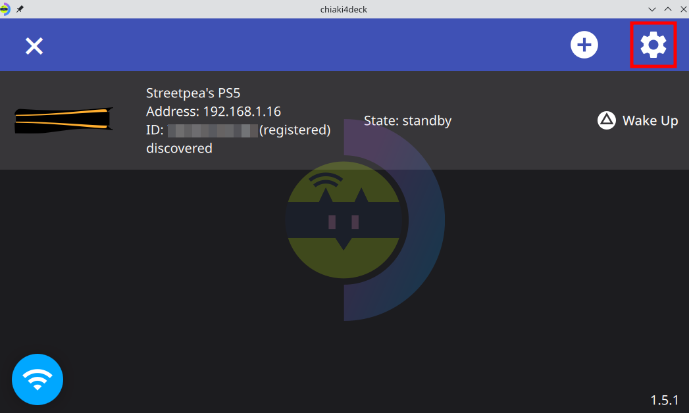

2. Adjust the settings to your preferences moving between settings by either clicking or using L1/R1.

    1. **General Settings**

        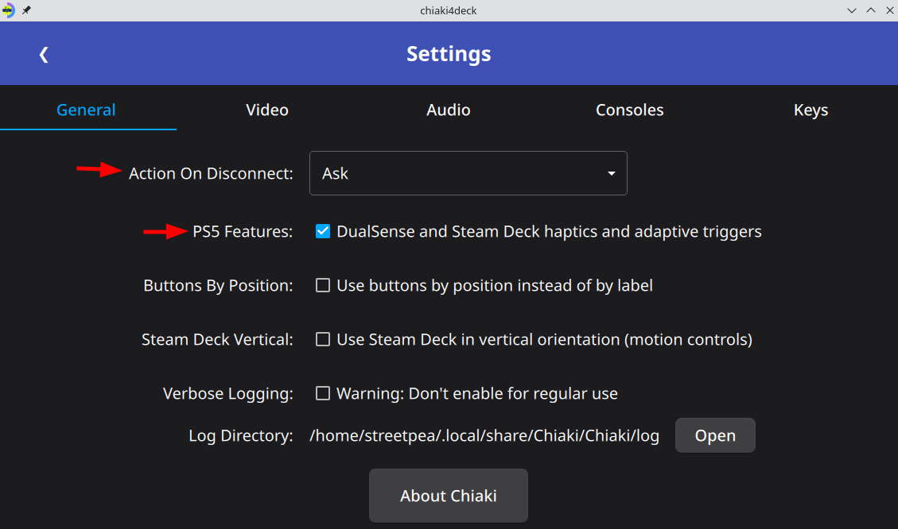

        !!! Tip "Enabling PlayStation 5 Features (PS5 Users Only)"

            If you want to enable haptics for Steam Deck and DualSense (must be attached via USB) and adaptive triggers for DualSense (USB or bluetooth), check the box that the red arrow is pointing to in the image above. On Mac, please follow the instructions [here](controlling.md#enabling-dualsense-haptics-on-macos){target="_blank" rel="noopener"} to enable haptics on MacOS. This is opt-in now since these features are currently experimental. Additionally, for the DualSense controller to work with these features in game mode, please disable Steam Input for the DualSense controller following the "Turning off Steam Input" tab in [this section](controlling.md#enabling-chiaki-ng-to-work-with-dualsense-dualshock-4){target="_blank" rel="noopener"}.

        !!! Info "Use Buttons by Position Instead of by Label"

            This enables the option to use the face buttons of your controller by position (i.e., NSEW) as opposed to by their label (i.e., ABXY). This enables you to use a Nintendo-style controller and still be able to use the buttons in the same positions as on a PlayStation controller instead of the swapped Nintendo controller positions.

        !!! Info "Use Steam Deck in Vertical Orientation"

            For Steam Deck, this enables the option to use the Steam Deck in vertical orientation in games that assume a horizontal controller for motion controls. Since most PlayStation games assume a horizontal facing controller, (even though data is sent for using the controller in any orientation) most games only work if the Steam Deck is horizontal (like you would hold a DualSense/DualShock 4 controller). This option enables you to play those games in vertical mode by allowing you to use roll instead of yaw and having a vertical orientation correspond to a horizontal facing controller. Some games, such as Astro's playroom use the orientation values and enable you to use the controller in various different positions (i.e. this option isn't needed for using the controller in vertical orientation for that small subset of games).

        !!! Tip "Putting your PlayStation Console to Sleep Automatically"

            For `Action on Disconnect`, choose `Ask` (the default) to get prompted (use the touchscreen to respond to prompt window) about putting your PlayStation to sleep when you close your session with ++ctrl+q++ (you will add this shortcut as part of you controller configuration in [controller section](controlling.md){target="_blank" rel="noopener"}). 
            
            If you prefer, you can also use `Enter Sleep Mode` to automatically put your PlayStation console to sleep as soon as you close your session with ++ctrl+q++
    
    2. **Video Settings**

        

    3. **Stream Settings**

        (choose the **PS5 HDR** tab if you have a PS5 connected to a HDR TV/monitor ([see HDR section below for more details](#hdr-high-dynamic-range)), **PS5** if you have a PS5 not connected to an HDR TV/monitor, and **PS4** if you have a PS4). If you are having issues with your PS5 connection, please try switching to 720P following with its default bitrate of 10,000 with your PS5 since that requires significantly less bandwidth from your wireless router.

        === "PS5 HDR"

            Stream output with [HDR](#hdr-high-dynamic-range). This are the recommended PS5 settings for a device that supports HDR such as the Steam Deck OLED.

            

            ???+ Question "Why 1080p if the client device [i.e., Steam Deck] is only 800p?"

                Using 1080p results in a better picture for me than 720p. The biggest factor in this seems to be [chroma-sub sampling](https://www.phonearena.com/news/Did-you-know-4K-vs-1080p-chroma-sub-sampling-and-why-you-should-record-in-4K-even-if-your-TV-does-not-support-it-yet_id61878){target="_blank" rel="noopener"}. In simple terms, the colors for an image are compressed and so you get a much lower resolution of color data than your image resolution. This means a 1080p image (with a high bitrate) will have more color data than a 720p image even if the image resolution itself ends up being 720p (since the color resolution will be higher than the equivalent 720p picture's color resolution). This results in an image that has more pop to it. Thus, I recommend streaming at 1080p if you have the bandwidth (good enough wireless router).
                
                However, if you are having issues with your wireless connection (i.e choppy audio, flashes in your video, or lag) while playing, then please use 720p instead. The gains you get from 1080p are nice, but aren't worth having a bad connection.

        === "PS5"

            These are the recommended PS5 settings for a device that doesn't support HDR like the ROG Ally.

            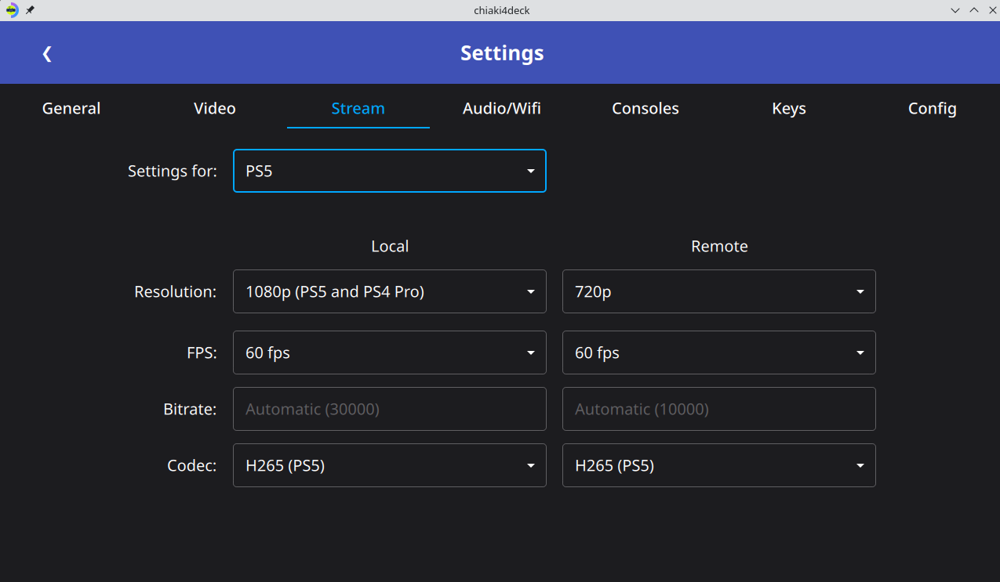

            ???+ Question "Why 1080p if the client device [i.e., Steam Deck] is only 800p?"

                Using 1080p results in a better picture for me than 720p. The biggest factor in this seems to be [chroma-sub sampling](https://www.phonearena.com/news/Did-you-know-4K-vs-1080p-chroma-sub-sampling-and-why-you-should-record-in-4K-even-if-your-TV-does-not-support-it-yet_id61878){target="_blank" rel="noopener"}. In simple terms, the colors for an image are compressed and so you get a much lower resolution of color data than your image resolution. This means a 1080p image (with a high bitrate) will have more color data than a 720p image even if the image resolution itself ends up being 720p (since the color resolution will be higher than the equivalent 720p picture's color resolution). This results in an image that has more pop to it. Thus, I recommend streaming at 1080p if you have the bandwidth (good enough wireless router).
                
                However, if you are having issues with your wireless connection (i.e choppy audio, flashes in your video, or lag) while playing, then please use 720p instead. The gains you get from 1080p are nice, but aren't worth having a bad connection.

        === "PS4"

            This is the recommended setting for a PS4. If you have a PS4 pro you can use 1080P instead.

            

    4. **Audio/WiFi Settings**

        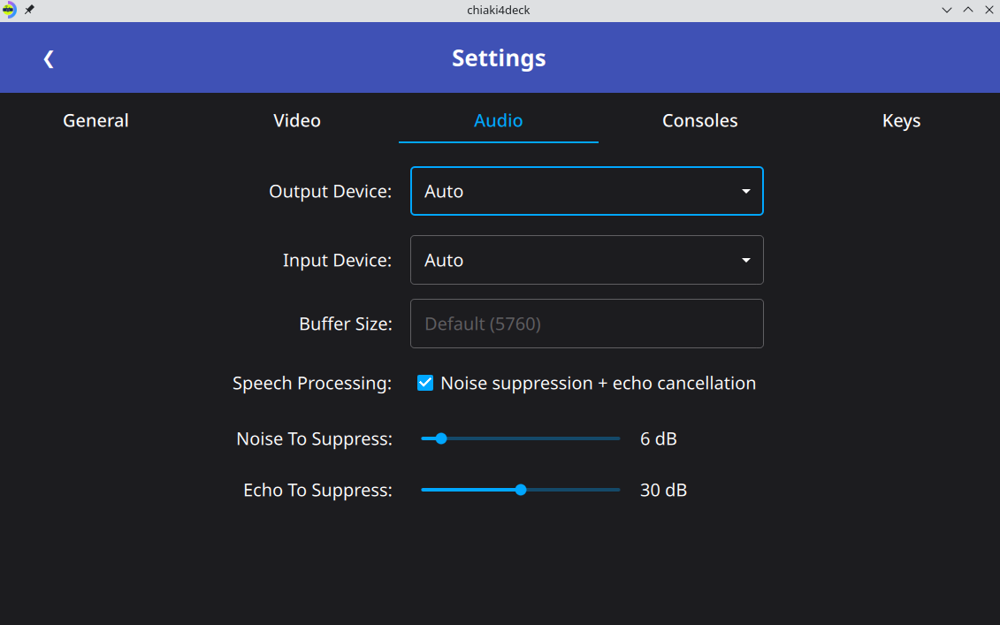

### HDR (High Dynamic Range)

HDR is now supported when you select the `H265 HDR (PS5 only)` codec option. For HDR to work you need to:

1. Use an HDR device such as the Steam Deck OLED or an OLED monitor attached to your client device for streaming (non-HDR device will still work but use [tonemapping](https://mixinglight.com/color-grading-tutorials/whats-tone-mapping/){target="_blank" rel="noopener"} instead of outputting HDR)
    
    ???+ Question "How do I know when HDR is active on my Steam Deck?"
        You can see when HDR is active by hitting the quick access button (3 dots button on the bottom right of the Steam Deck) going to the gear icon and looking at `BRIGHTNESS`. When HDR is active there will be a purple/blue banner to the right of the `BRIGHTNESS` label.

2. Connect your PS5 to a device such as an HDR TV or monitor (depending on the connected HDR TV/monitor it may also need to be turned on for the PS5 to output HDR)

    ???+ Question "How do I know if the PS5 is outputting HDR?"
        You can test the PS5 is outputting HDR by going to a game that has HDR settings in the menu such as Cyberpunk 2077 or Ghost of Tsushima and seeing if the game will let you adjust those.

3. Enable HDR in your PS5 settings (need to be connected directly to your PS5 and not via remote play to access this menu) by going to `Settings -> Screen and Video -> Video Output -> HDR` and selecting either `Always On` or `On When Supported`.

4. Select `H265 HDR (PS5 only)` as your codec option in `chiaki-ng`

5. Launch `chiaki-ng` via gamescope (i.e., game mode on the Steam Deck)

!!! Tip "Adjusting PS5 HDR for my client decice [i.e., Steam Deck]"

    You can adjust the PS5 HDR settings for optimal viewing on the client device [i.e., Steam Deck] via the system-wide PS5 settings (need to be connected directly to your PS5 and not via remote play to access this menu) by going to `Settings -> Screen and Video -> Video Output -> Adjust HDR`. You'll want to do this if your display brightness (i.e., nits) is different from the Steam Deck OLED's 1000 nits. According to the folks over at HDTVTest (via [arshiatn](https://github.com/arshiatn){target="_blank" rel="noopener"}) for an 1000 nits display you want to use 15-15-0 for the HDR settings. To set this in the `Adjust HDR set` move 15 steps (15 presses of the right key on the dpad of the PlayStation controller) for the first test screen, 15 steps from the beginning for the 2nd test screen and 0 steps from the beginning on the last test screen.
    
    Please note that this will also affect the settings for your connected display so if you are switching between remote play and TV play often keep that in mind. Certain games also have their own HDR settings you can adjust while remote playing in their respective game menus or when beginning the game.

### Auto Connect

If you have one console you want to connect to remotely or locally you can use the auto-connect feature to launch it automatically on launch. If you have multiple consoles to launch into you can instead use the [automation section](automation.md).

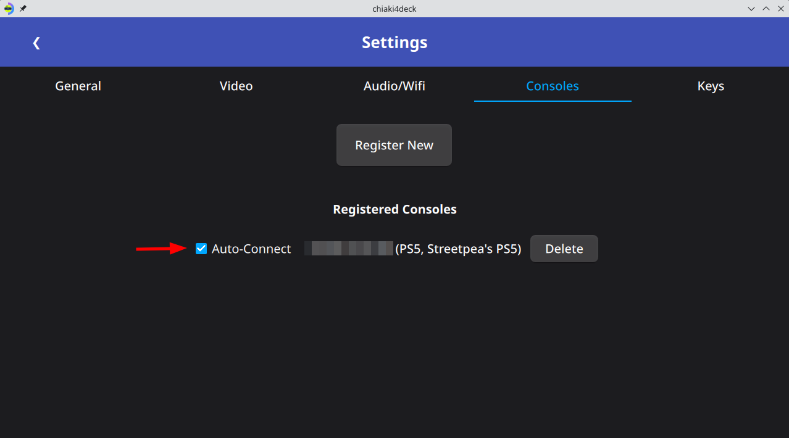

### Profiles

You can switch between profiles in chiaki-ng. If, for example, you have 2 users that both use the same device, you can create a profile for each user. You can see your current profile at the top of the chiaki-ng window and listed at Settings (Gear icon)->Config->Current profile. You can create, switch, and delete profiles via Settings (Gear icon)->Config->Manage Profiles.

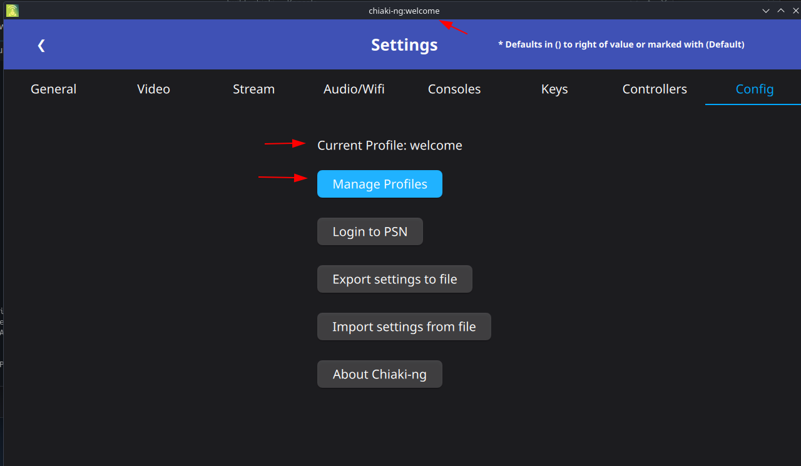

#### Creating a profile

1. Open Settings (Gear icon on top right of main screen)
2. Choose the `Config` tab
3. Click the `Manage Profiles` button
4. Choose `create new profile` from dropdown
5. Type in the name of the profile
6. Click `Create Profile` (this creates the new profile and switches to it)

#### Deleting a Profile

1. Open Settings (Gear icon on top right of main screen)
2. Choose the `Config` tab
3. Click the `Manage Profiles` button
4. Choose profile to delete from dropdown
5. Click delete checkbox
6. Click `Delete Profile` (this deletes the profile)

!!! Question "Why can't I delete the profile?"

    You can't delete your currently selected profile or the default profile since the default profile needs to be able to be loaded and the current profile is in use.

#### Switching Profiles

1. Open Settings (Gear icon on top right of main screen)
2. Choose the `Config` tab
3. Click the `Manage Profiles` button
4. Choose profile to switch to from the dropdown
5. Click `Switch Profile`

#### Creating Shortcuts Using a Profile

To launch directly into a particular profile (instead of the last selected one) you can use the `--profile` option. This will automatically be filled in when creating a Steam shortcut using the given profile via the `Create Steam Shortcut` button. You can also manually include this in your options by adding `--profile=profile_name` to the appropriate place for your desktop shortcut (usually after the path to chiaki-ng) or in Steam's case to the end of the `Launch Options` section.

## Performance of Chiaki/`chiaki-ng`

### My Experience

Ultimately, the performance will depend on the capability of your wireless router and which system ($PS5 > PS4 Pro > PS4$) you are using. Here are some notes from my experience using `chiaki-ng` on my Steam Deck with a PS5 console and a relatively good ($450 Mbps$ for $2.4GHz$ / $1,300 Mbps$ for $5GHz$) wireless router.

!!! Example "My Wireless Connection by the Numbers"

    I'm using the $5GHz$ band for `chiaki-ng` on my Steam Deck, meaning the total bandwidth for all devices on my local network is $1,300 Mbps$ (remember Internet connection itself doesn't matter since we're only using our wireless router for local streaming). Since I am using the settings in [Choosing Your Remote Play Settings](#choosing-your-remote-play-settings), I'm using $30,000 Kbps$ or $30 Mbps$ out of the total of $1,300 Mbps$. This means I'm using about $2\%$ of my $5GHz$ band. In other words, I still have plenty of bandwidth for watching Netflix :zany_face: while I play on my Steam Deck!

!!! Question "What Performance Can I Expect?"

    I am currently getting close to native performance using `chiaki-ng` on my Steam Deck with my PS5. This gives me better performance than I get playing performance heavy games directly on Steam Deck (like that one game where the kid gets bit by a :spider:)

    Benefits:

    - 5-6 hours of battery life (vs 1-2 hours playing the same games natively on Steam Deck)
    - access to PlayStation collection (games I have already purchased or have via PS Plus) including exclusives
    - no fan noise when playing
    - PlayStation Trophies

    Negatives:

    - occasional performance issues with certain games (specifically games with VSync enabled)

!!! example "Games I've Played Successfully Using `chiaki-ng` So Far..."

    - Stray
    - God of War (2018)
    - Genshin Impact (turned off VSync in settings to get rid of white flashes during gameplay)
    - Sekiro (occasional white flashes in areas with high crowds. Luckily, **these went away as I got further in the game** and never affected my ability to progress. Unfortunately, this seems to be due to VSync being enabled automatically with no option to turn it off. It only affected about 3 hours of the game in total [12 flashes with 1 or 2 every 15-30 minutes or so] before it went away completely).
    - Fall Guys
    - MultiVersus
    - Red Dead Redemption 2
    - Marvel's Spider Man
    - Ghost of Tsushima (changed from Resolution Mode to Performance Mode in game settings for native-like performance)
    - Chicory: A Colorful Tale
    - Concrete Genie
    - Astro's Playroom
    - Death's Door
    - Resident Evil 0
    - The Last of Us Remastered
    - Many More ...

### Troubleshooting Performance Issues

!!! Example "Examples of performance issues"

    - white flashes
    - green flashes
    - audio choppiness/crackling
    - excessive lag 

To fix these issues, try the following:

1. If you are not using the settings listed in [Choosing Your Remote Play Settings](#choosing-your-remote-play-settings), try with those settings and see if that fixes it for you. The biggest of these is using a HW Decoder option for your system which should help significantly.

2. If you are on Steam Deck OLED and you are using the Steam Deck after waking up from sleep, please trying turning the wifi off and then back on in the Steam Deck settings and see if this improves your performance (this is likely due to a WiFi driver issue with the Steam Deck OLED on certain networks so can't be fixed by chiaki-ng)

3. Switch to **720p** from 1080p

    **720p** requires less bandwidth than 1080p. This will help if your wireless connection is the problem, especially since it's very easy to do. This can fix video artifacts (white / green flashes) and audio choppiness (both results of connection problems).

4. Try **short preamble**

    If you are still having trouble (I didn’t need this but it can help in general and helped significantly improve performance for other streaming services such as Game Pass on my Steam Deck), try using using [short preamble instead of long preamble](https://www.interline.pl/Information-and-Tips/Preamble-Type-Short-Or-Long){target="_blank" rel="noopener"} in your router settings. You need to change this directly in your router settings for the given network and can do it per network if you set up more than one. This is incompatible with old devices (using wifi b/g instead of n or ac). Devices from 2011 and newer are required by law to support it and so will definitely work. Older devices may or may not support it depending on if they have either n or ac wireless support. Short preamble helps the $5GHz$ connection for devices that support it (essentially anything that’s connecting on a $5GHz$ network should use it). For streaming, you can set up one network that uses short for your newer devices ($5GHz$ network for me) and one with long for older devices ($2.4 GHz$ network for me since older devices don’t support $5GHz$ anyway). My connection worked fine with long preamble on a $2.4 GHz$ network for Chiaki but short (and a $5GHz$ network for that matter) works better in general for devices that support it and has helped others using Chiaki as well as me to help reduce Game Pass streaming lag (which is still much worse than Chiaki and not close to native, but works well for games that don’t require fast or moderately fast reaction times).

5. For specific game issues, change game resolution settings

    For example, the game may be set to 4k / resolution mode even though it's only streaming at 1080p or even 720p. Additionally, it may be using HDR (which the Steam Deck screen doesn't support). Switching these settings off on a game level results in less processing power used on the game and thus more left over for streaming as well as hitting a higher framerate. For example, I switched `Ghost of Tsushima` from resolution mode to performance mode and noticed that the occasional performance problems I was experiencing evaporated and the visual quality became much more stable due to the lack of occasional stutters. It went from being playable but a noticeable downgrade to indistinguishable from native.

6. **Turn off VSync** or the equivalent in games that use it
    
    VSync should only be enabled on the client side while streaming and having it enabled in the game itself can cause issues since it requires some extra overhead and can't actually sync with your screen if you're streaming the game. This resulted in issues with white flashes for me while playing Genshin Impact and Sekiro. When I turned off VSync in the Genshin Impact settings, these flashes (which had happened multiple times a minute with VSync on) disappeared. This affects only a small number of games, but is something to watch out for if you randomly have an issue with one game while others run well with Chiaki/`chiaki-ng`.

7. Switch framerate to **30fps**

    **30fps** requires less bandwidth than **60fps**. This will help if your wireless connection is the problem, especially since it's very easy to do. This can fix video artifacts (white / green flashes) and audio choppiness (both results of connection problems). I put this last because it is the biggest performance downgrade and most of the time you don't need to do this. However, switching to 30fps / 720p at the default settings is the most surefire way to fix connection issues and a last resort if the methods with virtually no downsides don't do the trick.

## Chiaki/`chiaki-ng` via Internet (Outside of Home Connection)

!!! Info "Chiaki/`chiaki-ng` Outside of your Home Network"
    
    You can also either the remote connection via PSN or open up ports to connect from the Internet, but the performance will not be as good, with increased input lag being the most noticeable downgrade. In this scenario, your connection will depend on both the Internet connection of your PlayStation console via the router and the Internet connection of your computer via your location (internet speeds themselves will apply). The farther away (more hops from your router) you get, the worse the performance will get. If you are still in the same state, it will likely still be relatively good. However, if you go cross-country or something like that, it can degrade significantly. Nevertheless, it can be very convenient to use while traveling, especially when playing less timing intensive games (i.e., games that would play well via cloud streaming). Setup is covered in the [remote connection section](remoteconnection.md){target="_blank" rel="noopener"}.
