# Controller Configuration

## Configuring Steam Deck Controller Profile

!!! Tip
    If you created the Steam Shortcut through the menu, it automatically adds the correct chiaki4deck+ mic controller profile for you on Steam Deck.

Get all of the shortcuts mapped to Steam Deck controls. Start by going to the `chiaki-ng` game menu and selecting the controller layout to configure controller options.

=== "Game Mode"

    

=== "Desktop Mode"

    

### Retrieving chiaki-ng Controller Layouts when Using An Alternate Game Name [Most Users Can Skip This]

???- Tip "Only If You Didn't Use `chiaki-ng` As the Name of the Game in Steam [Click to Open Me]"

    1. Change the name of your game (i.e., `Playstation Launcher Thingamajig`) temporarily to `chiaki-ng`

        1. Open the properties menu of `Playstation Launcher Thingamajig` (whatever you called it) by hitting the options button when selecting the game or the gear icon on the game page and selecting `Properties...` from the menu that pops up.

            

        2. Change the game name to `chiaki-ng`

            

    2. Get the controller layout from the `COMMUNITY LAYOUTS` via the normal process.

        1. Click the current layout box (it says: *Browse Community Layouts for games without official controller support* underneath it).

        2. Move to the `COMMUNITY LAYOUTS` tab and select `chiaki4deck+ mic` by `gmoney23`

            

    3. Export the layout as a `Personal Save`

        1. Click the gear icon and select `Export Layout` as the option

            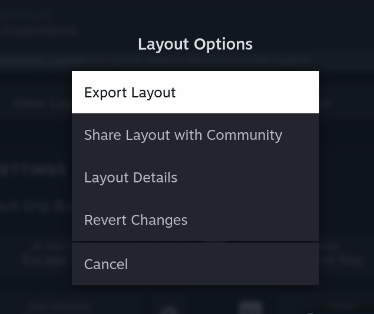

        2. Save the layout as a `New Personal Save`

            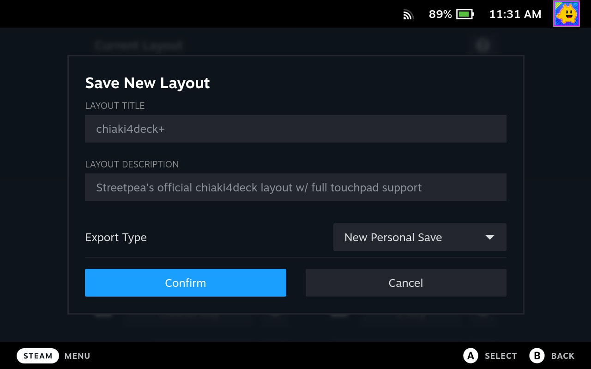

    4. Change your game name to whatever you would like

        1. Go back into the properties menu for the game

        2. Change your game name back to what you wanted

            

    5. Choose the desired layout which is now available for your differently named game

        1. Click on your current layout

        2. Select the saved community layout from the `YOUR LAYOUTS` tab

            

    6. Play with the layout

    !!! Info "Getting Steam Controls for Non-Steam Games"

        An interesting aside is that you can exploit this same process to get the official controller layout for a game that has a Steam version but you added as a non-Steam game. In that instance, you would be changing the game name to the Steam App ID for that game which you can find by searching [SteamDB here](https://steamdb.info/apps/){target="_blank" rel="noopener"} among other ways (i.e., looking at the # in the URL of the game on the Steam Store).

### Default Controller Profile

The easiest way to configure all of the necessary shortcuts for `chiaki-ng` is to copy the profile I have created in the `COMMUNITY LAYOUTS` tab.

1. Click the current layout box (it says: *Browse Community Layouts for games without official controller support* underneath it).

2. Move to the `COMMUNITY LAYOUTS` tab and select `chiaki4deck+ mic` by `gmoney23` (the `chiaki4deck+` layout was from before the toggle mic mute button mapping to the L4 back button was added and the original `chiaki4deck` layout was from before touchpad mapping to the trackpad and touchscreen was added)

    

#### Default `chiaki-ng` Layout Mapping Full View

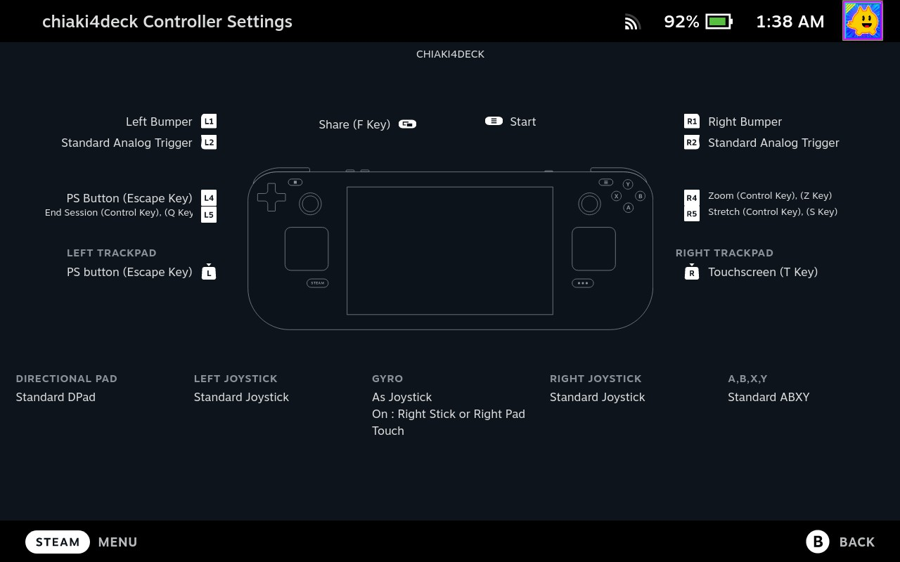

#### Default `chiaki-ng` Layout Touchscreen Mapping

Use native gestures and swiping the touchscreen to perform touchpad actions. Please keep in mind that the touchscreen is mapping to the PlayStation touchpad (that is what the PlayStation console / games expect) so it behaves like a touchpad (i.e., cursor position moves based on your gesture relative to the current cursor position instead of snapping to your finger location). This is important to note for games with a cursor such as *Chicory: A Colorful Tale* as it can seem weird when using a touchscreen but is actually correct / desired in this case.

Use the edges of the touchscreen (top, bottom, left, or right 5% of the screen) to activate touch click. 

!!! Note "Games with Region-Based Touchpad Click" 
    
    For games that separate the PlayStation touchpad into 3 regions, you can use a left edge touchscreen tap for left touchpad click, right edge touchscreen tap for right touchpad click and top or bottom middle of the touchscreen tap for middle touchpad click.

#### Default `chiaki-ng` Layout Trackpad Mapping

I have mapped the left trackpad as the PlayStation button and the right trackpad as the PlayStation controller touchpad (press for touchpad click and swipe for touchpad gestures). This essentially works the exact same way as when you're playing with the DualSense of DualShock4 touchpad. You touch/swipe for gestures and click for touchpad click.

The touchpad gestures are mapped using a mouse region with left mouse click on touch (i.e., simulates holding down the ++left-button++ while moving a mouse) and the touchpad click is mapped to ++t++.

!!! Note "Right Click Works too"

    Clicking the mouse ++right-button++ instead of the ++t++ key would have the same effect.

#### Default `chiaki-ng` Layout Back Button Mapping

I have mapped `L4` to toggle mic mute, `L5` to end session (++ctrl+q++), `R4` to zoom (++ctrl+z++), and `R5` to stretch (++ctrl+s++).

#### Default `chiaki-ng` Layout Gyro Mapping

I have also mapped gyro controls `As joystick`. Whenever you touch the right joystick, you can move the Steam Deck to aim / control the right stick (usually mapped to camera control) with motion (gyro) controls. You can use this on its own or for small adjustments to larger camera movements made by directly moving the right joystick. You can always change this by choosing to edit the layout and going into the gyro settings. 

!!! Info "Native Gyro for Steam Deck"

    Gyro is also directly mapped under the hood for the Steam Deck controller. Thus, when you play a game that has native gyro controls, those will work without needing to do anything in your control mapping via Steam Input. When you are playing a game with native gyro support, you may want to change the gyro mapping from `As joystick` to `None` so that gyro only maps to gyro in the game (i.e., you don't move the camera while trying to move a paintbrush using native gyro).

    Of course, you could leave the right stick mapping on (so that it maps to both gyro and right joystick), if that is truly what you want.

## Standard Controller Mappings

You can create your own controller profile by mapping the relevant buttons in Steam or using the [controller mapper](#change-controller-mapping) to map your controller's button to the PlayStation controller buttons. The [special button mappings](#special-button-mappings-you-need-to-assign-these-yourself) (functions not assigned to the controller by default) [set these] and the [standard button mappings](#standard-button-mappings-these-directly-map-and-dont-need-to-be-specifically-set) (controls that directly map and are thus assigned by default) [no need to set these unless you prefer different mappings] are listed in tables below for your convenience.

### Special Button Mappings (You need to assign these yourself)

!!! Warning "MacOS Commands not Controls"

    For Macos shortcuts replace ++ctrl++ with ++cmd++ for all sequences below.

| Function | Button | Description                                                                 |
| ---------|--------|-----------------------------------------------------------------------------|
| `Quit`   |  ++ctrl+q++ | Close `chiaki-ng` cleanly, putting console in sleep mode if desired  |
| `Zoom`   |  ++ctrl+z++ | Toggle between zoom (zoomed in to eliminate borders, cutting off edge of screen) and non-zoom (black borders) |
| `Stretch`| ++ctrl+s++  | Toggle between stretch (stretched to eliminate borders, distorting aspect ratio of image), and non-stretch (black borders with default aspect ratio) |
| `Full Screen` | ++f11++ / `Double Click` | Toggle between full screen and regular mode (Note: Double click for fullscreen toggle needs to be enabled in video settings.)|
| `PlayStation Button`| ++esc++ | The PlayStation / home button as it normally functions on a PlayStation controller |
| `Share Button` | ++f++ | The Share button on the PS5 controller used for taking screenshots, videos, etc. stored on your PS5 and uploaded to the PlayStation app on your phone if you so choose. |
| `Touchpad Click` | ++t++, mouse ++right-button++, tapping border (top, bottom, left or right 5%) of the touchscreen | These actions will all result in a touchpad click. For games that separate the touchpad into multiple regions, they work in conjunction with either the current mouse location (location of finger on Steam Deck trackpad) or current finger location (which edge of the touchscreen you tapped) to delineate which region you are using (most games just have one region for touchpad click though). |
| `Touchpad Motion` | `Touchscreen touch`, mouse ++left-button++ ++plus++ Mouse Movement (i.e., `drag action` / mouse region touch). | Maps to the PlayStation touchpad (since that's what PlayStation games / the remote streaming console expect). This means that the "cursor" (if one is defined for the game like in *Chicory: A Colorful Tale*) moves according to your gestures but does not snap/follow your fingers' locations (i.e., it behaves like a touchpad as it should).|
| `Toggle Mic Mute` | ++ctrl+m++ | The toggle microphone mute on and off button on the PlayStation controller. |
| `Stream Menu` | ++ctrl+o++ | This brings up a stream menu which shows things like your current Mbps. |

!!! Tip "Two Button Shortcuts"

    If you want to create a shortcut that includes 2 buttons like ++ctrl+q++, add the first key (i.e., ++ctrl++) and then click the gear icon to the right of the added command (i.e., ++ctrl++) and select `Add sub command`. Finally, fill in the new blank rectangle that appears with the desired second key (i.e., ++q++)

    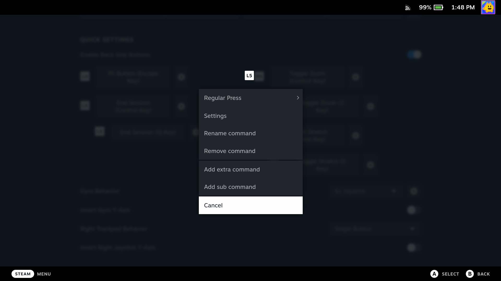 

### Using Steam Deck Controller Touchscreen in Your Custom Controller Profile

In order to use the Steam Deck touchscreen as a touchscreen instead of a mouse in Game Mode, you need to enable `Touchscreen Native Support` for it in controller options (this is done for you in the default `chiaki-ng` layout `chiaki4deck+ mic`). For your custom controller profile, do the following:

1. Edit your controller layout and scroll down to the `Action Sets` tab (on the left menu). 
    
2.  Click the gear icon to the right of the given action set (i.e., `Default`). 

    
        
3. Select `Add Always-On command`. 

    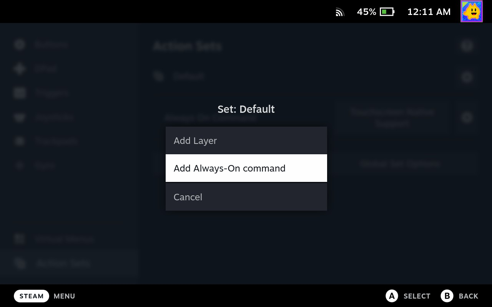

4. Move to the `SYSTEM` tab (use `R1` to switch tabs) and select `Touchscreen Native Support` from the commands.

5. Your `Action Sets` tab should now look like the following:

    

### Gyro Controls

Gryo directly maps for games that support it (i.e., Concrete genie, Astro's Playroom, The Last of Us, Ghost of Tsushima, etc.) for the Steam Deck controller (using native interface since SDL doesn't support motion or trackpad controls for Steam virtual controllers) as well as attached controllers that SDL supports with an accelerometer and gyro (i.e., DualSense, DualShock 4, etc.). For this to work, do the following based on your controller:

- Steam Deck (works out of the box, nothing needed)
- DualSense, DualShock4 or other controller with gyro + accelerometer supported by SDL
    - disable Steam Input for the controller following [Using a DualSense and/or DualShock4 Controller with `chiaki-ng`](#using-a-dualsense-andor-dualshock4-controller-with-chiaki-ng) below

Additionally, you can use gyro controls for camera options with any game by mapping gyro `As joystick` and adding a condition for when it's used (i.e., `On` with a condition of `right joystick touch`) in the gyro settings for `chiaki-ng`. I have done this in the [default `chiaki-ng` control setting](#default-chiaki-ng-layout-mapping-full-view) and you can do it in your custom control scheme. However, when playing games that have native gyro support (such as Concrete Genie or The Last of Us) you will most likely want to change the gyro mapping from `As joystick` to `None` so that gyro only maps to gyro in the game (i.e., you don't make your camera move when you're trying to shake your flashlight, etc.).

### Haptics and Adaptive Triggers

PlayStation 5 haptics are mapped for both the DualSense controller (usb connection required) and the Steam Deck controller and adaptive triggers are mapped for the DualSense controller (usb or bluetooth).

If you are using a DualSense controller in Game mode on the Steam Deck or via Steam, you will also need to disable Steam Input for the controller when it's first plugged in following the "Turning off Steam Input" tab [here](#enabling-chiaki-ng-to-work-with-dualsense-dualshock-4){target="_blank" rel="noopener"}.
Once checked, haptics and adaptive triggers (DualSense only) will work in games that support them when streaming from a PlayStation 5. If the DualSense is plugged in via USB (either initially or plugged in during a gaming session), haptics will be directed to it. If you are using the Steam Deck and don't have a DualSense plugged in, haptics will be directed to it and played via the trackpads.

### Microphone

Unmute microphone with either ++ctrl+m++ or the mic button on the PlayStation controller. (This is set to `L4` in the default chiaki4deck+ mic controller layout.) Then, use the microphone as normal. You can choose your microphone in the Steam Deck settings as well as choosing between audio inputs in the chiaki-ng menu.

!!! Note "Bluetooth headset microphones don't work on Steam Deck by default"

    The Steam Deck does not currently support microphones over bluetooth by default so you will need to either use a hardwired headset or the Steam Deck microphone unless you change your Steam Deck settings to enable bluetooth headset support (it is currently experimental and turned off by default due to a noticeable drop in audio quality). Thus, it's advised to use either a hardwired headset or the internal microphone. If you really want to use a bluetooth headset and can live with the drop in audio quality see [How to enable bluetooth headset modes on Steam Deck](https://steamdecki.org/Steam_Deck/Wireless/Bluetooth#Enabling_More_Codecs_and_Enabling_Headsets){target="_blank" rel="noopener"}.

### Standard Button Mappings (These directly map and don't need to be specifically set)

| Function         | Button                  |
|------------------| ------------------------|
| `right joystick` | `right joystick`        |
| `left joystick`  | `left joystick`         |
| `dpad up`        | `dpad up`               |
| `dpad left`      | `dpad left`             |
| `dpad down`      | `dpad down`             |
| `dpad right`     | `dpad right`            |
| `start button`   | `option button`         |
| `triangle`       | `Y button`              |
| `square`         | `X button`              |
| `cross`          | `A button`              |
| `circle`         | `B button`              |
| `R1`             | `R1`                    |
| `R2`             | `R2`                    |
| `R3`             | `R3` (right-stick click)|
| `L1`             | `L1`                    |
| `L2`             | `L2`                    |
| `L3`             | `L3` (left-stick click) |
| `switch between dpad modes` | `L1+R1+dpad up`      |
| `stream menu`    | `L1+R1+L3+R3`           |

## Using a DualSense and/or DualShock4 Controller with `chiaki-ng`

While most users will want to just use `chiaki-ng` with the Steam Deck controller, you can also attach a DualShock 4 or DualSense controller via bluetooth or usbc. The controls will map automatically and there is even native touchpad (including gestures), gyro, haptics (DualSense via usb/usbc only), and adaptive triggers (DualSense only) support. This can be especially useful if you're playing `chiaki-ng` when connected to a dock using an external monitor or TV or if you just really like the feel of the traditional PlayStation controllers.

!!! Tip "Pairing your DualShock 4 / DualSense with Steam Deck via Bluetooth"

    While holding the `Share` button, hold the `PlayStation Button` to put your controller into pairing mode. On the Steam Deck, hit the `STEAM` button and then select the `Settings` tab and then the `Bluetooth` tab (i.e., `STEAM button->Settings->Bluetooth`). Then, select your device from the list of devices. Once paired, it will automatically connect in the future when you press the `PlayStation` button on the controller.

### Enabling `chiaki-ng` to Work with DualSense / DualShock 4

!!! Info "Make Sure your Controller is Connected for Configuration"

    Your PlayStation controller needs to be connected via bluetooth or usb cable for its tab to show up when you visit the `chiaki-ng` game page on your Steam Deck and edit the saved controller configuration. This configuration is specifically for your PlayStation controller and separate from the `Steam Deck` controller configuration for `chiaki-ng`. It will be activated automatically when you use the PlayStation controller with `chiaki-ng` (it will show up as a 2nd controller configuration since you will now have at least 2 active controllers [Steam Deck + PlayStation controller])

=== "Turning off Steam Input (Recommended)"

    Turning off Steam Input gets you as close to a native experience with your controller as possible (including the `Home button` serving as both the `Steam` and `PlayStation button` simultaneously).

    This is necessary for the following capabilities:

    1. Haptics (DualSense only, must be attached via USB)
    2. Adaptive triggers (DualSense only, USB or bluetooth)
    3. Gyro controls for games like Concrete Genie and Astro's Playroom (any controller SDL supports for gyro + accelerometer)

    !!! Warning "Won't Have Access to All `chiaki-ng` controls"

        With this option you won't have access to all of the shortcuts for `chiaki-ng` (toggling `stretch` ++ctrl+s++ and `zoom` ++ctrl+z++ screen options and quitting gracefully ++ctrl+q++) on your DualSense. However, if you have a keyboard connected to your Steam Deck, you can always use that for those shortcuts.

    Turn off Steam Input for your PlayStation controller by doing the following:
    
    1. Go to the `chiaki-ng` game page

    2. Select the gamepad icon on the right hand side of the page to go the controller configuration menu

        

    3. Move to the controller configuration tab for your PlayStation controller (if not already there)

    4. Click the gear icon to the right of `Edit Layout`

    5. Choose `Disable Steam Input` from the menu.

        

=== "Mapping All `chiaki-ng` Controls (Alternative Option)"

    This tab shows you how to use Steam Input to map all of the controls for `chiaki-ng` to your PlayStation controller. This is great if you are using `chiaki-ng` with a TV. Since the PS Button maps to the `STEAM` button automatically and there are several commands in the default `chiaki-ng` configuration bound to back buttons (that don't exist on the PlayStation controllers), I have added these controls to a touch menu. It will show up when touching the left pad of the `chiaki-ng` controller. You have to click to select one of the extra commands (so you don't accidentally choose one during gameplay) from the radial menu. See the picture below for an example of what this looks like in-game:

    

    !!! Warning "No Haptics, Adaptive Triggers, or Gyro"

        Using Steam Input with your DualSense controller means you won't have access to haptics, adaptive triggers, or gyro controls via your DualSense. If these are important to you, please disable steam input according to the other tab.

    The easiest way to configure all of the necessary shortcuts for `chiaki-ng` on DualSense is to copy the profile I have created in the `COMMUNITY LAYOUTS` tab with the aforementioned touch menu for extra commands. DualShock 4 can also use a similar layout mapping.

    ???+ example "Add Default PlayStation Controller Mapping"

        1. Go to the `chiaki-ng` game page

        2. Select the gamepad icon on the right hand side of the page to go the controller configuration menu

            

        3. Move to the controller configuration tab for your PlayStation controller (if not already there)

        4. Click the current layout box (it says: *Browse Community Layouts for games without official controller support* underneath it).

        5. Move to the `COMMUNITY LAYOUTS` tab and select `DualSense` by `gmoney23`

            

    This is what the full mapping looks like for reference:

    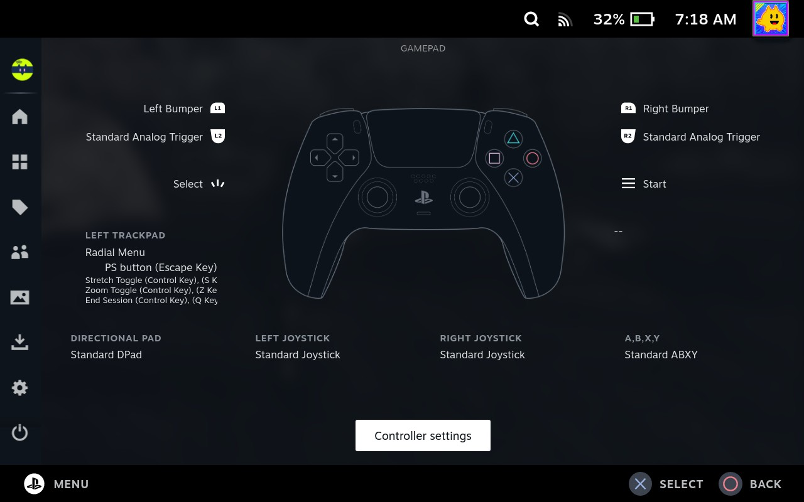

    !!! Note "Map it How you Want"

        Using Steam Input there are a variety of ways to map controls. Do whatever you like best. Additionally, you can use gyro controls for camera options with games that don't support native gyro by mapping the gyro `As joystick`. Make sure to set an appropriate condition for when it's used (i.e., `when holding R1` or `Always On`) in the gyro settings for the PlayStation controller configuration option of `chiaki-ng`. For example, I have done this in the [Steam Deck controller `chiaki-ng` control setting](#default-chiaki-ng-layout-mapping-full-view) and you can do it for your DualSense control scheme as well. However, when playing games that have native gyro support (such as Concrete Genie or The Last of Us) you will most likely want to either temporarily this option or make sure to set something to enable it that you won't hit accidentally. Otherwise, both the native gyro and the action you map will be done in-game which can make your camera move when you're trying to shake your flashlight, etc.

### Enabling DualSense Haptics on MacOS

In order to enable DualSense haptics on MacOS please do the following:

1. Plug in your DualSense controller via usbc to your Mac
2. Use ++command+space++ to bring up the spotlight search and begin to type `Audio MIDI Setup` and hit enter to bring up the Audio Midi Setup utility. 
    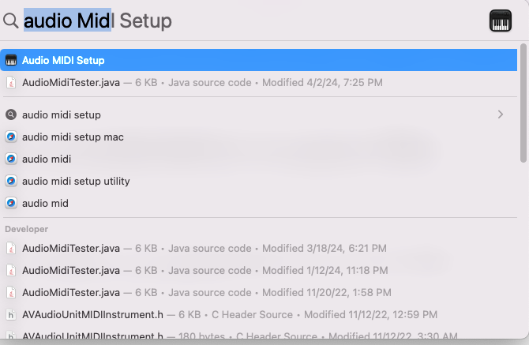

3. Select your DualSense Wireless Controller Output device in the Audio Midi Setup utility
4. Click `Configure Speakers`

    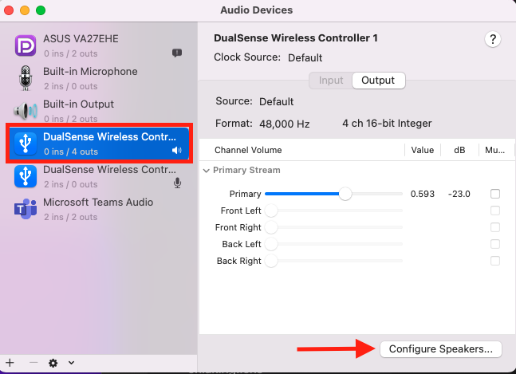

5. Select `Quadrophonic` from the configuration dropdown
6. Select Apply

    

7. Play your favorite PS5 game with haptic feedback on Mac via `chiaki-ng`!

## Using a non-PlayStation controller with chiaki-ng

### Controller Mapping

#### Change Controller Mapping

You can re-map all necessary PlayStation buttons to your controller using the controller mapper built-in to `chiaki-ng`.

1. Go to Settings->Controllers and select `Change Controller Mapping`

    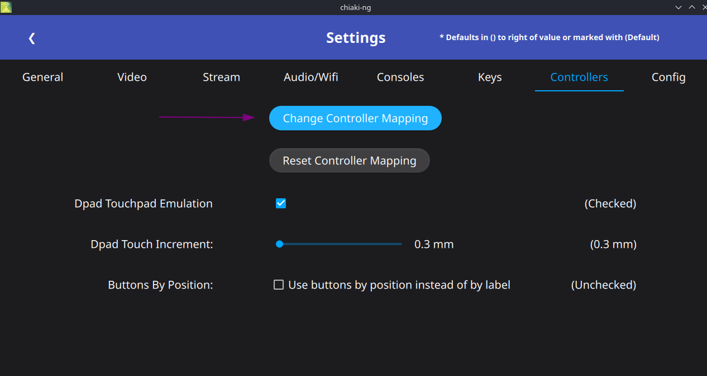

2. Click on any button on the controller you want to change the mapping for

3. Change the buttons as you see fit on the controller mapping page (i.e., change touchpad to Share button on the Xbox Series X Controller)

    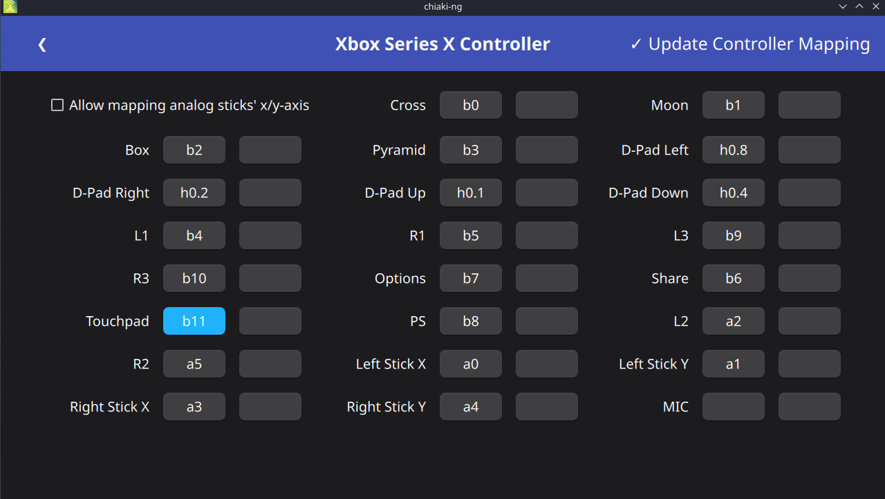

4. Update Controller Mapping using the `Options` button on the controller

#### Reset Controller Mapping

You can reset a controller mapping for a controller back to default at any time

1. Go to Settings->Controllers and select `Reset Controller Mapping`

2. Click on any button on the controller you want to reset the mapping for

### Dpad Touch Emulation

Non-PlayStation controllers such as Xbox and Nintendo controllers don't have a touchpad. To use touchpad functionality in games, chiaki-ng provides dpad touch emulation. It is enabled by default in Settings->Controllers and can be disabled at any time. The `Dpad Touch Increment` controls how far away the next touch on the dpad will be when holding down a direction on the dpad. Changing this will make you "move across the touchpad" (in the currently pressed dpad direction) farther or nearer to your current position.

#### Switching Dpad Mode

Use the dpad touch switch button combo (default is `L1+R1+Dpad Up` but it's user configurable in settings->Controllers) to switch between regular dpad and dpad touch emulation while in game.

#### Examples

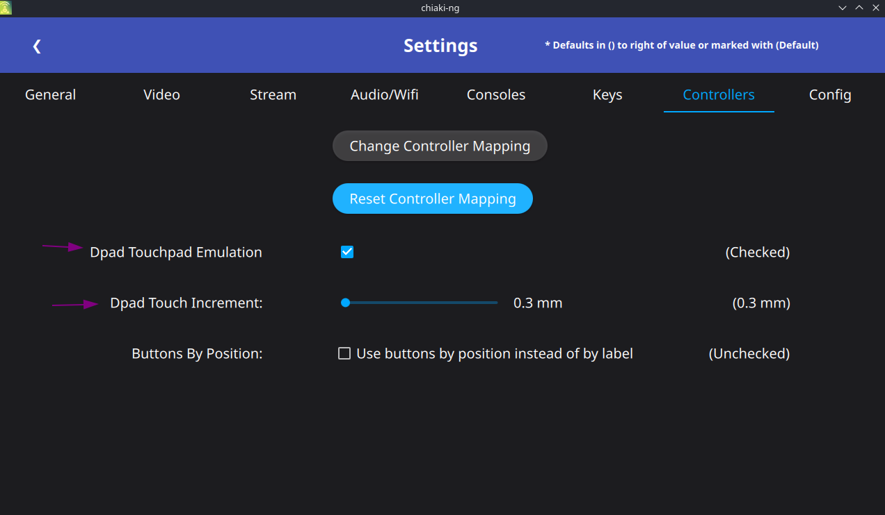

!!! Question "How does Dpad Touch Emulation work"

    When the dpad touch mode is enabled (toggled via the dpad touch switch button combo mentioned above), pushing one of the dpad buttons will register a touch in the quadrant of that button:

    - Dpad Left: All the way to the left and halfway up the touchpad

    - Dpad Right: All the way to the right and halfway up the touchpad

    - Dpad Up: In the middle of the touchpad horizontally and at the top of the touchpad

    - Dpad Down: In the middle of the touchpad horizontally and at the bottom of the touchpad

    How to perform some common touchpad functions with the dpad:

    - For a touchpad left click:

        You want to press the touchpad click button you have mapped for your controller (such as the Share key) and dpad left

    - For a touchpad right click:

        You want to press the touchpad click button you have mapped for your controller (such as the Share key) and dpad right

    - For a swipe from left to right:

        First touch dpad left and then hold dpad right for a second or so. This will start you at the left side of the touchpad and move you across the touchpad in the right direction.

    - For a swipe from right to left:

        First touch dpad right and then hold dpad left for a second or so. This will start you at the right side of the touchpad and move you across the touchpad in the left direction.

    - For a swipe from up to down:

        First touch dpad up and then hold dpad down for a second or so. This will start you at the top of the touchpad and move you across the touchpad in the down direction.

    - For a swipe from down to up:

        First touch dpad down and then hold dpad up for a second or so. This will start you at the bottom of the touchpad and move you across the touchpad in the up direction.