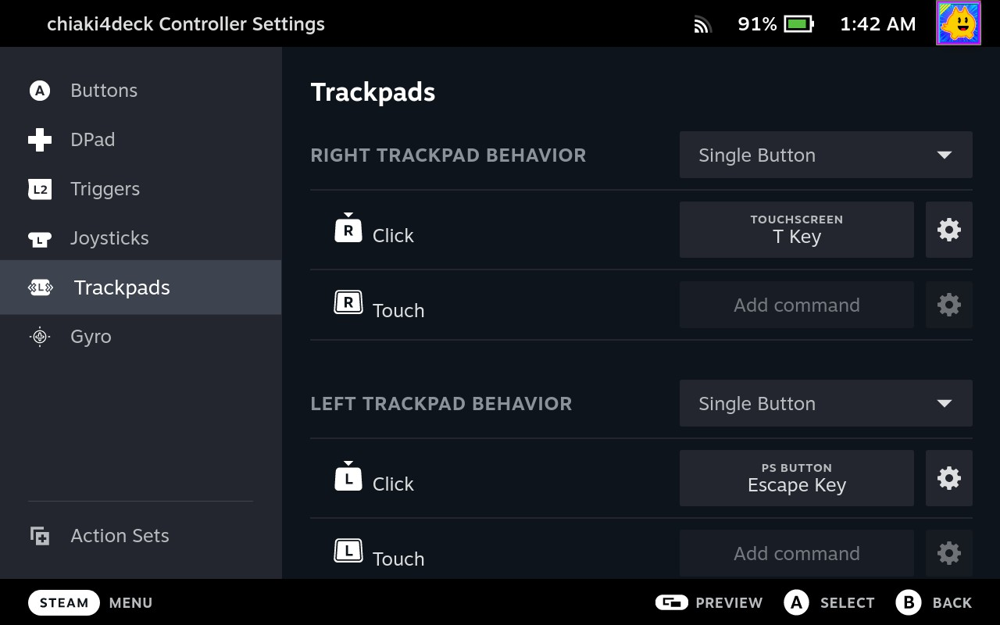

# Configuring Steam Deck Controller Profile

Get all of the shortcuts mapped to Steam Deck controls. Start by going to the `chiaki4deck` game menu and selecting the controller layout to configure controller options.

=== "Game Mode"

    

=== "Desktop Mode"

    

## Default Controller Profile

The easiest way to configure all of the necessary shortcuts for `chiaki4deck` is to copy the profile I have created in the `COMMUNITY LAYOUTS` tab. 

1. Click the current layout box (it says: *Browse Community Layouts for games without official controller support* underneath it).

2. Move to the `COMMUNITY LAYOUTS` tab and select `chiaki4deck` by `gmoney23`

    

    !!! Warning "PlayStation Login Passcode Entry"
        
        If you have to enter a passcode (4 digit pin) every time you boot up your PlayStation to play, you have a login passcode. Please follow the steps below. **Otherwise, you (most users) can skip this warning as it doesn't apply to you.**
        
        **Choose 1 of the following 2 options**:
    
        - Keep your passcode because you have it for a good reason (i.e., you're sharing a console and don't want the other person(s) accessing your account):
        
            1. *One time only*: Choose `chiaki4deck w/ keyboard` from the `COMMUNITY LAYOUTS` tab instead of the `chiaki4deck` layout. This maps the top left back button (L4) to the show keyboard system command. 

            2. *Each time you launch `chiaki4deck` and login*:
                
                1. Wait for the login passcode dialog box to appear.
            
                2. Hit the top left back button (L4) to bring up the on-screen Steam Deck virtual keyboard.

                3. Enter you passcode using the keyboard (either via touch or controller navigation) to login to your PlayStation console (use ++enter++ / R2 to submit the passcode). 

            **OR**

        - Delete the PlayStation Login passcode to bypass needing to enter your passcode each time you login.

            === "PS5"

                Go to `Settings -> Users and Accounts -> Login Settings -> Delete Your PS5 Login Passcode`

            === "PS4"

                Go to `Settings -> Users -> Login Settings -> Passcode Management -> Delete`

        !!! info "Automated pin entry coming"

            I'm working on adding pin entry to the automation so that you can set your passcode on the Steam Deck without having to re-enter it each time [here](https://github.com/streetpea/chiaki4deck/issues/5){target="_blank" rel="noopener noreferrer"}. This will be good for you if you share your PlayStation but have your own Steam Deck.

### Default `chiaki4deck` Layout Mapping Full View


### Default `chiaki4deck` Layout Trackpad Mapping



I have mapped the trackpads as single buttons triggered when you press them down.  The left trackpad is the PlayStation button and the right trackpad is a PlayStation controller touchpad click.

### Default `chiaki4deck` Layout Back Button Mapping


I have mapped L4 to the PlayStation button, L5 to end session (++ctrl+q++), R4 to zoom (++ctrl+z++), and R5 to stretch (++ctrl+s++).

### Default `chiaki4deck` Layout Gyro Mapping

I have also mapped gyro controls `As joystick`. Whenever you touch the right joystick or trackpad, you can move the Steam Deck to aim / control the camera with motion (gyro) controls in addition to moving the right joystick. You can always change this by choosing to edit the layout and going into the gyro settings.

## Creating your Own Controller Profile

You can create your own controller profile by mapping the relevant buttons. The [special button mappings](#special-button-mappings-you-need-to-assign-these-yourself) (functions not assigned to the controller by default) [set these] and the [standard button mappings](#standard-button-mappings-these-directly-map-and-dont-need-to-be-specifically-set) (controls that directly map and are thus assigned by default) [no need to set these unless you prefer different mappings] are listed in tables below for your convenience.

### Special Button Mappings (You need to assign these yourself)

| Function | Button | Description                                                                 |
| ---------|--------|-----------------------------------------------------------------------------|
| `Quit`   |  ++ctrl+q++ | Close `chiaki4deck` cleanly, putting console in sleep mode if desired  |
| `Zoom`   |  ++ctrl+z++ | Toggle between zoom (zoomed in to eliminate borders, cutting off edge of screen) and non-zoom (black borders) |
| `Stretch`| ++ctrl+s++  | Toggle between stretch (stretched to eliminate borders, distorting aspect ratio of image), and non-stretch (black borders with default aspect ratio) |
| `PlayStation Button`| ++esc++ | The PlayStation / home button as it normally functions on a PlayStation controller |
| `Share Button` | ++f++ | The Share button on the PS5 controller used for taking screenshots, videos, etc. stored on your PS5 and uploaded to the PlayStation app on your phone if you so choose. |

!!! Tip "Two Button Shortcuts"

    If you want to create a shortcut that includes 2 buttons like ++ctrl+q++, add the first key (i.e., ++ctrl++) and then click the gear icon to the right of the added command (i.e., ++ctrl++) and select `Add sub command`. Finally, fill in the new blank rectangle that appears with the desired second key (i.e., ++q++)

    

### Standard Button Mappings (These directly map and don't need to be specifically set)

| Function         | Button                  |
|------------------| ------------------------|
| `right joystick` | `right joystick`        |
| `left joystick`  | `left joystick`         |
| `dpad up`        | `dpad up`               |
| `dpad left`      | `dpad left`             |
| `dpad down`      | `dpad down`             |
| `dpad right`     | `dpad right`            |
| `start button`   | `option button`         |
| `triangle`       | `Y button`              |
| `square`         | `X button`              |
| `cross`          | `A button`              |
| `circle`         | `B button`              |
| `R1`             | `R1`                    |
| `R2`             | `R2`                    |
| `R3`             | `R3` (right-stick click)|
| `L1`             | `L1`                    |
| `L2`             | `L2`                    |
| `L3`             | `L3` (left-stick click) |

### Gyro and Touch Controls

!!! Notice "Native Touchpad Gesture and Gyro Support"

    As of now, gyro and touch controls (other than the touchpad click) do not directly map for games that support those (i.e., Ghost of Tsushima for touch gesture and Concrete genie for gyro controls) on the Steam Deck controller. In order to get around this, you can either:
    
    1. Remap controls in accessibility options if the specific game supports that.
    2. Connect a DualSense or DualShock4 controller following [Using a DualSense and/or DualShock4 Controller with `chiaki4deck`](#using-a-dualsense-andor-dualshock4-controller-with-chiaki4deck) below.
    
    In the future, I plan to update `chiaki4deck` to support native gyro and touch for the Steam Deck controller. This affects a small subset of games. However, it is important to note when thinking of which games to play with Chiaki/`chiaki4deck`.

Additionally, you can use gyro controls for camera options with any game (with gyro in the game itself turned off) by mapping gyro `As joystick` and adding a condition for when it's used (i.e., `On` with a condition of `right touchpad or right joystick touch`) in the gyro settings for `chiaki4deck`. I have done this in the [default `chiaki4deck` control setting](#default-chiaki4deck-layout-mapping-full-view) and you can do it in your custom control scheme.

## Using a DualSense and/or DualShock4 Controller with `chiaki4deck`

While most users will want to just use `chiaki4deck` with the Steam Deck controller, you can also attach a DualShock 4 or DualSense controller via bluetooth or usbc. The controls will map automatically and there is even native touchpad (including gestures) and gyro support. This can be especially useful if you're playing `chiaki4deck` when connected to an external monitor or TV or if you just really like the feel of the traditional PlayStation controllers.

!!! Tip "Pairing your DualShock 4 / DualSense with Steam Deck via Bluetooth"

    While holding the `Share` button, hold the `PlayStation Button` to put your controller into pairing mode. On the Steam Deck, hit the `STEAM` button and then select the `Settings` tab and then the `Bluetooth` tab (i.e., `STEAM button->Settings->Bluetooth`). Then, select your device from the list of devices. Once paired, it will automatically connect in the future when you press the `PlayStation` button on the controller.

### Enabling `chiaki4deck` to Work with DualSense / DualShock 4 Gyro and Touchpad

!!! Caution "Password Required"

    This requires setting a password for your Steam Deck (if you haven't already). This is because you have to give access to the PlayStation controllers' accelerometer/gyroscope and touchpad to your user so that `chiaki4deck` can read them using `libevdev`. This itself is not dangerous, but changing udev rules in general can be which is why this is a restricted action that requires the use of sudo (with a password). Once you set your password, you need to make sure you put it in your password manager or remember it. Otherwise, if you ever need to use a command that requires a password again, you won't be able to use it and will have to use the [recovery instructions for the Steam Deck](https://help.steampowered.com/en/faqs/view/1B71-EDF2-EB6D-2BB3){target="_blank" rel="noopener noreferrer"}. Please don't let this be you! :see_no_evil:

1. Open a `konsole` session

2. Set a password (if you don't already have one) and save it safely. (i.e., password manager).

    ``` bash
    passwd
    ```

3. Add [udev rules](https://wiki.archlinux.org/title/Udev){target="_blank" rel="noopener noreferrer"} for PlayStation controllers' touchpads and accelerometers (gyroscopes)

    1. Download the [71-chiaki4deck.rules](https://raw.githubusercontent.com/streetpea/chiaki4deck/main/doc/71-chiaki4deck.rules){target="_blank" rel="noopener noreferrer"} udev rules file from GitHub using the following `konsole` command:

        ```bash
        curl -LO https://raw.githubusercontent.com/streetpea/chiaki4deck/main/doc/71-chiaki4deck.rules
        ```

    2. Look at the file to see the rules

        ```bash
        cat 71-chiaki4deck.rules
        ```

        ???+ example "71-chiaki4deck.rules"

            ``` yaml
            # Enable access to Touchpad and accelerometer (gyro) for DualShock4 & DualSense controllers for PlayStation Remote Play
            # DualShock 4
            # USB
            SUBSYSTEM=="input", ATTRS{idVendor}=="054c", ATTRS{idProduct}=="05c4", ENV{ID_INPUT_TOUCHPAD}=="?*", TAG+="uaccess"
            SUBSYSTEM=="input", ATTRS{idVendor}=="054c", ATTRS{idProduct}=="05c4", ENV{ID_INPUT_ACCELEROMETER}=="?*", TAG+="uaccess"
            # Bluetooth
            SUBSYSTEM=="input", KERNELS=="*054C:05C4*", ENV{ID_INPUT_TOUCHPAD}=="?*", TAG+="uaccess"
            SUBSYSTEM=="input", KERNELS=="*054C:05C4*", ENV{ID_INPUT_ACCELEROMETER}=="?*", TAG+="uaccess"

            # DualShock 4 wireless adapter
            # USB
            SUBSYSTEM=="input", ATTRS{idVendor}=="054c", ATTRS{idProduct}=="0ba0", ENV{ID_INPUT_TOUCHPAD}=="?*", TAG+="uaccess"
            SUBSYSTEM=="input", ATTRS{idVendor}=="054c", ATTRS{idProduct}=="0ba0", ENV{ID_INPUT_ACCELEROMETER}=="?*", TAG+="uaccess"
            # Bluetooth
            SUBSYSTEM=="input", KERNELS=="*054C:0BA0*", ENV{ID_INPUT_TOUCHPAD}=="?*", TAG+="uaccess"
            SUBSYSTEM=="input", KERNELS=="*054C:0BA0*", ENV{ID_INPUT_ACCELEROMETER}=="?*", TAG+="uaccess"

            # DualShock 4 Slim
            # USB
            SUBSYSTEM=="input", ATTRS{idVendor}=="054c", ATTRS{idProduct}=="09cc", ENV{ID_INPUT_TOUCHPAD}=="?*", TAG+="uaccess"
            SUBSYSTEM=="input", ATTRS{idVendor}=="054c", ATTRS{idProduct}=="09cc", ENV{ID_INPUT_ACCELEROMETER}=="?*", TAG+="uaccess"
            # Bluetooth
            SUBSYSTEM=="input", KERNELS=="*054C:09CC*", ENV{ID_INPUT_TOUCHPAD}=="?*", TAG+="uaccess"
            SUBSYSTEM=="input", KERNELS=="*054C:09CC*", ENV{ID_INPUT_ACCELEROMETER}=="?*", TAG+="uaccess"

            # PS5 DualSense controller
            # USB
            SUBSYSTEM=="input", ATTRS{idVendor}=="054c", ATTRS{idProduct}=="0ce6", ENV{ID_INPUT_TOUCHPAD}=="?*", TAG+="uaccess"
            SUBSYSTEM=="input", ATTRS{idVendor}=="054c", ATTRS{idProduct}=="0ce6", ENV{ID_INPUT_ACCELEROMETER}=="?*", TAG+="uaccess"
            # Bluetooth
            SUBSYSTEM=="input", KERNELS=="*054C:0CE6*", ENV{ID_INPUT_TOUCHPAD}=="?*", TAG+="uaccess"
            SUBSYSTEM=="input", KERNELS=="*054C:0CE6*", ENV{ID_INPUT_ACCELEROMETER}=="?*", TAG+="uaccess"
            ```

        !!! question "Why do I Need to Add Udev Rules?"

            Udev rules control which devices you can access. The default rules for SteamOS give access to all joystick devices, but not touchpad or gyro devices because some of them are used in non-gaming electronics. Therefore, we need to give your user access to the PlayStation controllers' gyro and trackpad devices so `chiaki4deck` can read their events (so you can use the devices while playing). I have created and tested a file to give the minimum amount of permissions to accomplish what we need. `054c` is Sony's Vendor ID and the various Product IDs are for the different controllers. `ENV{ID_INPUT_TOUCHPAD}=="?*"` &  `ENV{ID_INPUT_ACCELEROMETER}=="?*"` specifically target the touchpad and accelerometer (gyro) devices for these controllers. Finally, the `TAG+="uaccess"` gives users physically logged into your Steam Deck access to these devices (users like you :smile:).

    3. Copy the file to `etc/udev/rules.d/` (the location for user added rules)

        ``` bash
        sudo mv 71-chiaki4deck.rules /etc/udev/rules.d/71-chiaki4deck.rules
        ```

4. Restart your Steam Deck

5. Boot into `chiaki4deck` in Game Mode or Desktop Mode with a DualShock 4 or DualSense attached via usb or bluetooth and enjoy!

    !!! Success "Tested Against Ghost of Tsushima + Concrete Genie + What you Play Next!"
    
        I successfully used a DualSense to test gyro using Concrete Genie and touchscreen using Ghost of Tsushima with the `chiaki4deck` flatpak. Try the next game yourself!

### Control Scheme for `chiaki4deck` using DualSense / DualShock 4

!!! Info "Make Sure your Controller is Connected for Configuration"

    Your PlayStation controller needs to be connected via bluetooth or usb cable for its tab to show up when you visit the `chiaki4deck` game page on your Steam Deck and edit the saved controller configuration. This configuration is specifically for your PlayStation controller and separate from the `Steam Deck` controller configuration for `chiaki4deck`. It will be activated automatically when you use the PlayStation controller with `chiaki4deck` (it will show up as a 2nd controller configuration since you will now have at least 2 active controllers [Steam Deck + PlayStation controlller])

=== "Mapping All `chiaki4deck` Controls (Recommended)"

    This tab shows you how to use Steam Input to map all of the controls for `chiaki4deck` to your PlayStation controller. This is great if you are using `chiaki4deck` with a TV. Since the PS Button maps to the `STEAM` button automatically and there are several commands in the default `chiaki4deck` configuration bound to back buttons (that don't exist on the PlayStation controllers), I have added these controls to a touch menu. It will show up when touching the left pad of the `chiaki4deck` controller. You have to click to select one of the extra commands (so you don't accidentally choose one during gameplay) from the radial menu. See the picture below for an example of what this looks like in-game:

    

    The easiest way to configure all of the necessary shortcuts for `chiaki4deck` on DualSense is to copy the profile I have created in the `COMMUNITY LAYOUTS` tab with the aforementioned touch menu for extra commands. DualShock 4 can also use a similar layout mapping.

    ???+ example "Add Default PlayStation Controller Mapping"

        1. Go to the `chiaki4deck` game page

        2. Select the gamepad icon on the right hand side of the page to go the controller configuration menu

            

        3. Move to the controller configuration tab for your PlayStation controller (if not already there)

        4. Click the current layout box (it says: *Browse Community Layouts for games without official controller support* underneath it).

        5. Move to the `COMMUNITY LAYOUTS` tab and select `DualSense` by `gmoney23`

            

    This is what the full mapping looks like for reference:

    

    !!! Note "Map it How you Want"

        Using Steam Input there are a variety of ways to map controls. Do whatever you like best. Additionally, you can use gyro controls for camera options with games that don't support native gyro by mapping the gyro `As joystick`. Make sure to set an appropriate condition for when it's used (i.e., `when holding R1` or `Always On`) in the gyro settings for the PlayStation controller configuration option of `chiaki4deck`. For example, I have done this in the [Steam Deck controller `chiaki4deck` control setting](#default-chiaki4deck-layout-mapping-full-view) and you can do it for your DualSense control scheme as well. However, when playing games that have native gyro support (such as Concrete Genie or The Last of Us) you will most likely want to either temporarily turn off this option or make sure to set something to enable it that you won't hit accidentally. Otherwise, both the native gyro and the action you map will be done in-game which can make your camera move when you're trying to shake your flashlight, etc.

=== "Turning off Steam Input (Alternative Option)"

    You could also turn off Steam Input entirely to get as close to a native experience with your controller as possible (including the `Home button` serving as both the `Steam` and `PlayStation button` simultaneously).

    !!! Caution "Won't Have Access to All `chiaki4deck` controls"

        With this option you won't have access to all of the shortcuts for `chiaki4deck` (toggling `stretch` ++ctrl+s++ and `zoom` ++ctrl+z++ screen options and quitting gracefully ++ctrl+q++) on your DualSense. However, if you have a keyboard connected to your Steam Deck, you can always use that for those shortcuts. 

    Turn off Steam Input for your PlayStation controller by doing the following:
    
    1. Go to the `chiaki4deck` game page

    2. Select the gamepad icon on the right hand side of the page to go the controller configuration menu

        

    3. Move to the controller configuration tab for your PlayStation controller (if not already there)

    4. Click the gear icon to the right of `Edit Layout`

    5. Choose `Disable Steam Input` from the menu.

        