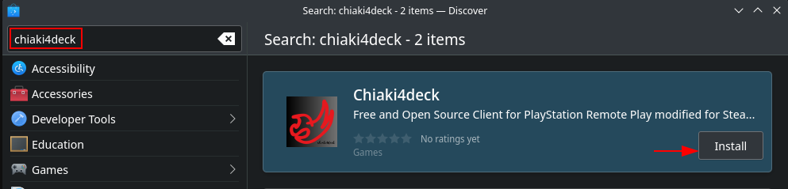

# Installing `chiaki4deck`

!!! Tip "Copying from and Pasting into Konsole Windows"

    You can copy from and paste into `konsole` windows with ++ctrl+shift+c++ (copy) and ++ctrl+shift+v++ (paste) instead of the normal ++ctrl+c++ (copy) and ++ctrl+v++ (paste) shortcuts. In fact, ++ctrl+c++ is a shortcut to terminate the current process in the `konsole`. Additionally, you can still right-click and select copy or paste as per normal.

=== "Using the Discover Store (Recommended)"

    1. Open the Discover store

        

    2. Search for `chiaki4deck` in the search bar

        

    3. Click Install

=== "Using the `konsole` (If for some reason it doesn't show up on the Discover store)"

    1. Run the following command in the `konsole`

        ```
        flatpak install -y io.github.streetpea.Chiaki4deck
        ```

!!! Note "About `chiaki4deck`"

    This is a flatpak I created for `chiaki4deck` from [updated](../updates/done.md){target="_blank" rel="noopener"} Chiaki source code is available on Flathub. This is the recommended install as it is the most straightforward.
    
    However, you can also build the flatpak yourself (recommended for users who want to add their own source code changes on top of the ones I've made) by following the instructions in [Building the flatpak yourself](../diy/buildit.md){target="_blank" rel="noopener"}.


