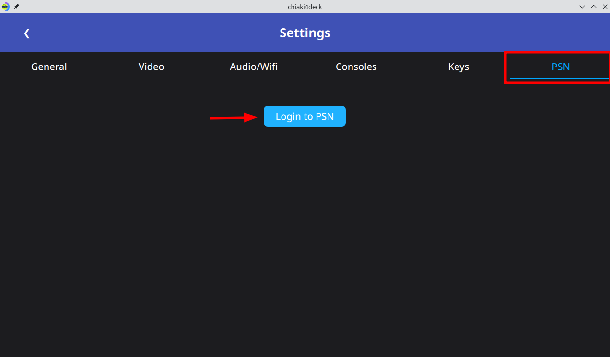

# Set up chiaki4deck to work outside of your home network

## Remote Connection via PSN

**Supports Both IPv4 and IPV6**

### Overview

The remote connection via PSN uses PSN servers as an initial go-between to exchange the necessary information to initiate a direct connection between your client device (i.e., computer, portable gaming device, etc.) and your PlayStation console using a technique called [UDP Holepunching](https://en.wikipedia.org/wiki/UDP_hole_punching){target="_blank" rel="noopener"}. This replicates the behavior of this feature in the official remote play app from Sony.

!!! Question "Why do I need to login to PSN and how is this token used?"

    The remote connection via PSN requires you to login to PSN to generate an auth token used for contacting the PSN servers that serve as an initial go-between to initiate the direct connection to your PlayStation. 
    
    This auth token is stored locally and used to connect with the PSN servers (this can be verified by looking at the code [if you want to be doubly sure] as Chiaki4deck is open source) and not used or stored anywhere outside of that.

### Requirements

1. Console must be updated to the latest firmware
2. Console must be registered locally prior to using remote connection via PSN
3. To see the remote connection via PSN tab for the given console, the console must not be available locally (otherwise you would want to use a local connection as it is faster and more efficient)
4. Remote Connection via PSN for **PS4** only works with the main registered console for your PSN account (*Note: this is a limitation imposed by Sony not a limitation specific to Chiaki4deck*)

!!! Warning "Not All Networks Supported"

    Not all network types are supported by UDP holepunching. For some networks, this process will fail and in that case you will have to use a manual remote connection with port forwarding. If you have tried 5 or so times and it has failed consistently with the message *Couldn't contact PlayStation over established connection, likely unsupported network type*, your network type is currently unsupported. If you are able to connect over the same wireless connection with the official remote play app and are willing to help the Chiaki4deck developers improve Chiaki4deck to support your network type please reach out to the dev team via [Reddit](https://www.reddit.com/message/compose/?to=Street_Pea_6693){target="_blank" rel="noopener"} or [email](mailto:streetpea@proton.me). If you are failing with *Connection over PSN failed closing ...*, please either add your logs to an appropriate existing issue or open a new issue on the Chiaki4deck Github.

### Setup

1. Go to the Chiaki4deck settings page by hitting the gear icon from the main page

    

2. Go to the PSN tab and then click `Login to PSN`

    

3. Login to psn on the provided page

    ???- Tip "Tips for those having trouble logging into to PSN"

        If you get a `connection to the server timed out` message, keep on trying to login by hitting ++enter++ every few seconds until you get a different error message such as `Can't connect to the server` or you have tried for at least 20 seconds. If that doesn't work, please try refreshing the page and going through the process again. If you still can't find success, make an attempt using a different browser.

        Unfortunately, we have no control over Sony's site (that gives out auth tokens to access their PSN servers for the remote connection over PSN setup) so we can only give tips on how best to handle the errors that may occur on the page and wish you the best in obtaining your token. Fortunately, once this token is obtained, Chiaki4deck will automatically refresh it as needed and only ask for you to create a new token in the event that PSN requires you to generate a new one using your login.

4. Copy your redirect url from the browser

    

5. Paste your redirect url on the page and create your token

    

6. See success message and close the dialog box

    

    !!! Danger "Error Message"

        If you obtain an error with a link to Sony's oauth site, it is likely the code from the link has expired and you need to create a new code by logging in again and pasting the url into Chiaki4deck. The code usually expires within a few minutes. Otherwise, the error code should hopefully be self explanatory.

### Initiating Connection

1. Register console (either locally or remotely via a manual connection) if it's not already registered
2. Switch to non-local internet (otherwise you would want to connect locally instead, so remote connections via PSN for consoles found locally aren't shown)
3. Click on the box of the console you want to connect to (it will say `Remote Connection via PSN`)

    

    !!! Question "What if my console doesn't appear"
    
        1. Make sure the console is registered via the standard local registration
        2. Make sure the console doesn't appear on your Chiaki4deck menu (i.e., make sure it's not available locally)
        3. Hit the button to `Refresh PSN hosts` to query the PSN network again for the console.

4. Wait for the connection to load
5. Play

!!! Tip "Testing"

    It may be hard to test if this feature is working properly for you at home (before using it remotely) if you don't have access to another network. In this case, you can use a cellular hotspot to test the connection.

## Manual Remote Connection

**Supports IPv4 only**

### Set Static IP

In order to prevent your IP from changing which would break the port forwarding rules if you ever disconnect your PlayStation console from your network and reconnect it (especially if other devices are added to the network in the meantime), you should go into your router settings and reserve an IP address for your PlayStation (DHCP IP reservation / "static" IP) or create a hostname for it. For a TP-Link, Netgear, Asus or Linskys router, follow [these instructions](https://www.coolblue.nl/en/advice/assign-fixed-ip-address-router.html){target="_blank" rel="noopener"}. If you have a different router, you can search (using a search engine such as DuckDuckGo or Google) for instructions for that specific router using the formula "dhcp reservation myroutername router" such as "dhcp reservation netgear router" and follow the instructions to reserve an IP for your PlayStation console so that it won't change. Alternatively, if your router has an option to set hostnames for your devices, you can set a hostname for your PlayStation console and use your hostname in the automation instead of a static IP address.

### Port Forwarding

Forward the ports for your console on your router following [this port forwarding guide starting with selecting your router](https://portforward.com/router.htm){target="_blank" rel="noopener"}

!!! Tip "Close out of ads"

    If any ads appear as you navigate the website just hit the close button on the given advertisement to continue on your journey.

=== "PS5"

    | Port | Connection Type |
    | ---- | --------------- |
    | 9295 | TCP             |
    | 9296 | UDP             |
    | 9297 | UDP             |
    | 9302 | UDP             |

=== "PS4"

    | Port | Connection Type |
    | ---- | --------------- |
    | 987  | UDP             |
    | 9295 | TCP             |
    | 9296 | UDP             |
    | 9297 | UDP             |

### Find Router's IP

On a computer connected to your router such as your Steam Deck (make sure to disconnect from a vpn first if you're connected to one to get the right IP) use one of the following:

=== "Browser"

    Visit [whatismyip](https://www.whatismyip.com){target="_blank" rel="noopener"} in your browser and copy the displayed IP

=== "Konsole/terminal"

    ``` bash
    curl checkip.amazonaws.com
    ```

### Test Connection

=== "GUI"

    1. Add console to GUI using remote IP as a new manual connection

        1. Click the plus icon in the main menu

            

        2. Create your remote connection

            

            1. Enter your remote IP/DNS

            2. Choose the locally registered console you want to remotely connect to

            3. Click Add
    
    2. Connect using this new connection

=== "Automation"

    Add your remote IP in the automation script when going through the next ([automation](automation.md){target="_blank" rel="noopener"}) section. Once setup on your local network, try to launch the PlayStation when connected to a different network such as a mobile hotspot.

!!! Question "If my connection stops working, what should I do?"

    If the connection stops working please make sure that the IP address for your router hasn't changed by checking it again via one of the methods above or a different one to make sure it's the same. If it has changed, you will need to update to the new IP address of your router.

