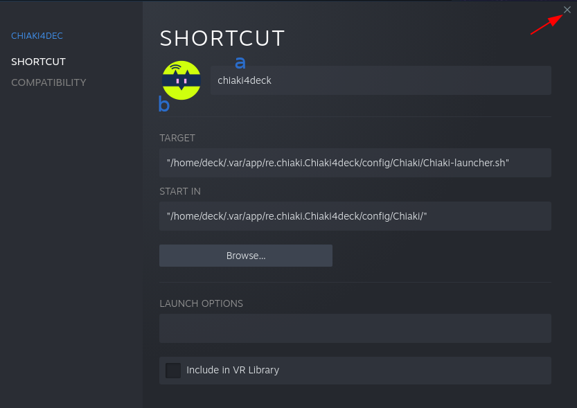

# Adding Chiaki4Deck to Steam

!!! Info "Another Non-Steam Game"

    This is the same process as with other non-Steam games, tailored to the `chiaki4deck` script and images.

1. Open the `Add a Non-Steam Game` prompt

    === "Via user interface / application (GUI)"
    
        1. Launch Steam by double clicking on the Steam icon in your desktop or finding it in your apps menu.

            

        2. Click `Add a Non-Steam Game` from the Games Menu on the top left of the Steam UI

            

    === "Via `konsole`"

        1. Run the following command in a `konsole` window to bring up the `Add Non-Steam Game` prompt

        ``` bash
        steam steam://AddNonSteamGame
        ```

2. Choose to `BROWSE` for the game

    

3. Choose `Chiaki-launcher.sh` as your game

    1. Choose `File type: All Files` at the bottom of the screen

    2. Choose `/home/deck` from the dropdown at the top of the screen and then navigate by clicking on each folder to the folder `/home/deck/.var/app/re.chiaki.Chiaki4deck/config/Chiaki`

    3. Click on the `Chiaki-launcher.sh` file in that directory

    4. Click `OPEN` on the bottom right 

    

4. Click `Add Selected Programs`

    


## Configuring Name and Game Icons

1. Acquire pictures to use for the game library in Steam

    1. Get the images I used [here](https://github.com/streetpea/chiaki4deck/releases/download/v1.0.0/chiaki4deckImages.tar.xz){target="_blank" rel="noopener noreferrer"} for `chiaki4deck` on my Steam Deck.

    2. Extract the package to a folder of your choice (such as your `Documents` folder).
    
        !!! Question "How do I extract the images folder?"
        
            Double click on the downloaded package in your browser or find the file in your `Downloads` folder and right-click on it choosing to `Extract To` and then selecting the folder of your choice (such as your `Documents` Folder)

            

        !!! note
            
            This will create a folder named `chiaki4deckImages` in the folder you choose to extract to

    !!! Note "SteamGridDB"
    
        The images I provided are from Steam Grid DB and I do not own these images, I'm simply directing you to them for your convenience. You can find these and other images yourself on [SteamGridDB](https://www.steamgriddb.com/search/grids?term=chiaki+remote+play){target="_blank" rel="noopener noreferrer"} as well as via other sources of your choosing.

2. If it is not already open, launch Steam and go to your game `Library`.

3. Right-click on `Chiaki-launcher.sh` in your `Games` on the left-hand side and select `Properties`

    

4. In the properties window that comes up rename `Chiaki-launcher.sh` and add the icon image

    1. Rename it `chiaki4deck` or a different name of your choosing like `PS Remote Play`

    2. Click on the blank square to add an image and navigate to the `chiaki4deckImages` folder you created in step 1 above and select the icon image (`icon-chiaki4deck.png`).

    3. Click the x to exit the window

    ???+ example "Finished chiaki4deck Properties"

        

5. Go to your `Library` in Steam and select `chiaki4deck` from the left-hand list or one of the `Library` categories to go to `chiaki4deck`'s game page.

6. Customize the background and logo for Chiaki4deck

    

    1. Customize the background
    
        1. Right-click on the blank space and select `Set Custom Background`

        2. Browse to the `chiaki4deckImages` folder you created earlier and select the background image (`background-chiaki4deck.png`)

    2. Customize the logo

        1. Right-click on the blank space and select `Set Custom Logo`

        2. Browse to the `chiaki4deckImages` folder you created earlier and select the logo image (`logo-chiaki4deck.png`)

    ???+ example "Finished chiaki4deck Home Page"

        

7. Customize the wide capsule and capsule images

    1. Launch `chiaki4deck` via Steam by hitting the `Play` button or any other method and then close.
    
    2. Go to your `Library` in Steam and scroll to your `RECENT GAMES` section.

    3. Right-click on the blank picture for `chiaki4deck` (should be 1st in `RECENT GAMES` and have a blank image with a landscape orientation) and select `Manage->Set custom artwork`

        

    4. Browse to the `chiaki4deckImages` folder you created earlier and select the wide capsule (wcap) image (`wcap-chiaki4deck.png`)

    5. Launch a different game and close it (this moves `chiaki4deck` into the second slot in recent games)

    6. Right-click on the blank picture for `chiaki4deck` (should be 2nd in recent games and have a blank image with a portrait orientation) and select `Manage->Set custom artwork`. 

    7. Browse to the `chiaki4deckImages` folder you created earlier and select the capsule (cap) image (`cap-chiaki4deck.png`)

!!! Success ":video_game: Game (Mode) Time!"

    You have successfully added `chiaki4deck` to Steam with pictures. :fireworks:
    
    You can now close any open applications and or terminals (forcing them to close if necessary) and then switch to **Game Mode** by clicking on the `Return to Gaming Mode` desktop icon.

    