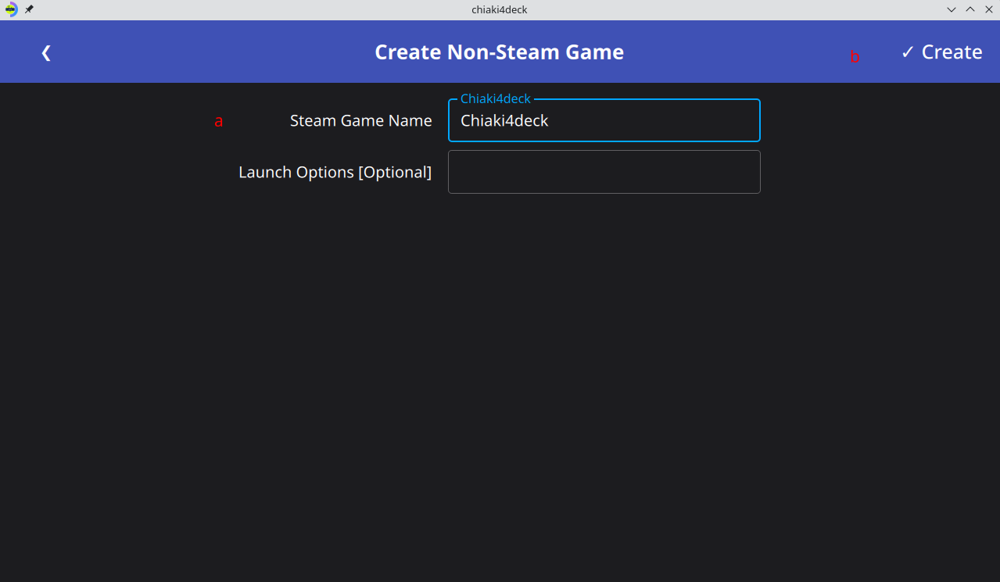
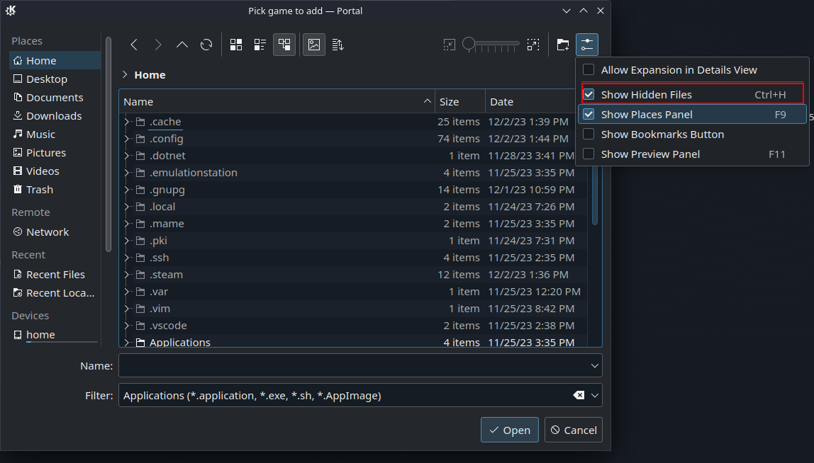
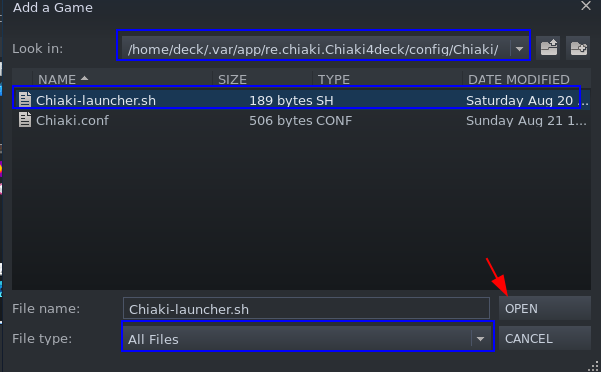
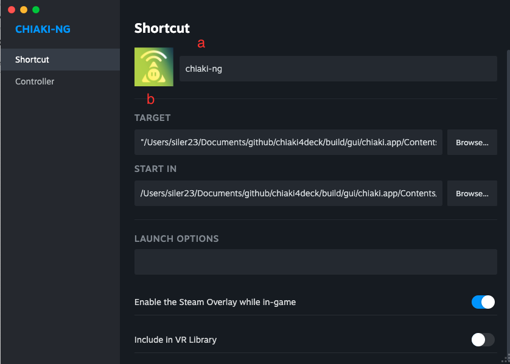
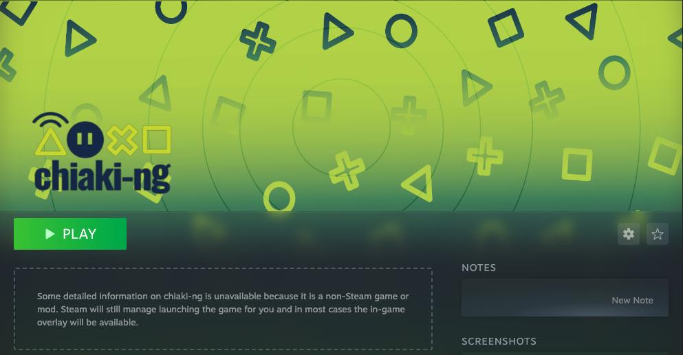
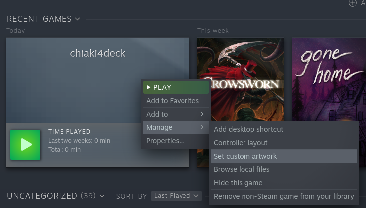

# Adding chiaki-ng to Steam

=== "Automatic Process for Auto-connect or Standard Launch"

    1. Choose `Add Create Steam Shortcut from Main Menu`

        

    2. Fill in name for Steam Shortcut and optional launch options

        1. Fill in name for Steam Shortcut and optional launch options
    
            !!! Note "Launch Options"
                In most cases, you can leave this blank. One scenario where you would fill this out is if you have multiple users on the same client device [i.e., Steam Deck]. In this case you can use `--profile user1` for one shortcut and `--profile user2` for another.

        2. Create Steam Shortcut by hitting `Create` button

        

    !!! Success ":video_game: Game (Mode) Time!"

        You have successfully added `chiaki-ng` to Steam with pictures and (if on Steam Deck) set the `chiaki4deck+ mic` Steam Deck controller shortcut. :fireworks:
        
        You can now close any open applications and or terminals (forcing them to close if necessary) and then switch to **Game Mode** by clicking on the `Return to Gaming Mode` desktop icon.

        

=== "Manual Process for Automation Script"

    !!! Info "Another Non-Steam Game"

        This is the same process as with other non-Steam games, tailored to the `chiaki-ng` script and images.

    1. Open the `Add a Non-Steam Game` prompt

        === "Via user interface / application (GUI)"
        
            1. Launch Steam by double clicking on the Steam icon in your desktop or finding it in your apps menu.

                

            2. Click `Add a Non-Steam Game` from the Games Menu on the top left of the Steam UI

                

        === "Via `konsole`"

            1. Run the following command in a `konsole` window to bring up the `Add Non-Steam Game` prompt

            ``` bash
            steam steam://AddNonSteamGame
            ```

    2. Choose to `BROWSE` for the game

        

    3. Show hidden files using the GUI or ++ctrl+h++ (to see the hidden `.` directories)

        

    4. Choose `Chiaki-launcher.sh` as your game

        !!! Tip "If You're missing `Chiaki-launcher.sh`, You Skipped the Automation Section"

            `Chiaki-launcher.sh` is a script to launch Chiaki without the main gui, resulting in a much better experience on the Steam Deck ([click for details](../updates/done.md#enabled-automated-launch-and-auto-connect){target="_blank" rel="noopener"}) and makes it [easier to use the 3 games modes](../updates/done.md#3-view-modes-for-non-standard-screen-sizes){target="_blank" rel="noopener"}. If `Chiaki-launcher.sh` is missing, you almost certainly skipped the automation section. Don't worry, the fix is easy! :relaxed: Please complete the [Automation section](automation.md){target="_blank" rel="noopener"} now and come back here afterward. It should take you ~ 5 minutes. Luckily, :four_leaf_clover: there is a helper script that does most of the work for you! You simply answer a few questions I walk you through.

        1. Choose `File type: All Files` at the bottom of the screen

        2. Choose `/home/deck` from the dropdown at the top of the screen and then navigate by clicking on each folder to the folder `/home/deck/.var/app/io.github.streetpea.Chiaki4deck/config/Chiaki`

        3. Click on the `Chiaki-launcher.sh` file in that directory

        4. Click `OPEN` on the bottom right 

        

    5. Click `Add Selected Programs`

        


    ## Configuring Name and Game Icons

    !!! Warning "Steam Application Name Matters!"

        For Non-Steam games (i.e., `chiaki-ng`), the `Community Layouts` controller layouts are based on the name the user set for the game in Steam when they exported it. Thus, in order to find the controller profiles I created for the game in your `Community Layouts` section later in this guide, your game name will need to the same as mine, (i.e., `chiaki-ng`). This naming is done in step 4 (below) and it's recommended that you just keep your game name as `chiaki-ng` to make your life easier.

        !!! Question "What if naming `chiaki-ng` something else fills me with determination...?"

            If you want to use a different game name (i.e., `Playstation Launcher Thingamajig`) and want to use some or all of the controller layouts I have created (either directly or to download them and use them as a starting point to tinker from), name your game what you want in step 4. Then, when you get to the controller section, follow [Retrieving chiaki-ng Controller Layouts when Using An Alternate Game Name](controlling.md#retrieving-chiaki-ng-controller-layouts-when-using-an-alternate-game-name-most-users-can-skip-this){target="_blank" rel="noopener"}. This walks you through temporarily renaming the app to `chiaki-ng` to access the controller layouts and save them as `Personal Save`s to access in the `Your Layouts` tab. Finally, you can rename you game to what you want and apply your layout to this differently named Steam game.

    1. Acquire pictures to use for the game library in Steam

        1. Get the official `chiaki-ng` images [here](https://raw.githubusercontent.com/streetpea/chiaki4deck/main/assets/chiaki-ngImages.tar.xz){target="_blank" rel="noopener"}.

        2. Extract the package to a folder of your choice (such as your `Documents` folder).
        
            !!! Question "How do I extract the images folder?"
            
                Double click on the downloaded package in your browser or find the file in your `Downloads` folder and right-click on it choosing to `Extract To` and then selecting the folder of your choice (such as your `Documents` Folder)

                

            !!! note
                
                This will create a folder named `chiaki-ng-images` in the folder you choose to extract to

    2. If it is not already open, launch Steam and go to your game `Library`.

    3. Right-click on `Chiaki-launcher.sh` in your `Games` on the left-hand side and select `Properties`

        

    4. In the properties window that comes up rename `Chiaki-launcher.sh` and add the icon image

        1. Rename it `chiaki-ng`

        2. Click on the blank square to add an image and navigate to the `chiaki-ng-images` folder you created in step 1 above and select the icon image (`steam_icon.png`).

        3. Click the x to exit the window

        ???+ example "Finished chiaki-ng Properties"

            

    5. Go to your `Library` in Steam and select `chiaki-ng` from the left-hand list or one of the `Library` categories to go to `chiaki-ng`'s game page.

    6. Customize the background and logo for chiaki-ng

        

        1. Customize the background
        
            1. Right-click on the blank space and select `Set Custom Background`

            2. Browse to the `chiaki-ng-images` folder you created earlier and select the background image (`steam_hero.png`)

        2. Customize the logo

            1. Right-click on the blank space and select `Set Custom Logo`

            2. Browse to the `chiaki-ng-images` folder you created earlier and select the logo image (`steam_logo.png`)

        ???+ example "Finished chiaki-ng Home Page"

            

    7. Customize the wide capsule and capsule images

        1. Launch `chiaki-ng` via Steam by hitting the `Play` button or any other method and then close.
        
        2. Go to your `Library` in Steam and scroll to your `RECENT GAMES` section.

        3. Right-click on the blank picture for `chiaki-ng` (should be 1st in `RECENT GAMES` and have a blank image with a landscape orientation) and select `Manage->Set custom artwork`

            

        4. Browse to the `chiaki-ng-images` folder you created earlier and select the wide capsule (wcap) image (`steam_landscape.png`)

        5. Launch a different game and close it (this moves `chiaki-ng` into the second slot in recent games)

        6. Right-click on the blank picture for `chiaki-ng` (should be 2nd in recent games and have a blank image with a portrait orientation) and select `Manage->Set custom artwork`. 

        7. Browse to the `chiaki-ng-images` folder you created earlier and select the capsule (cap) image (`steam_portrait.png`)

    !!! Success ":video_game: Game (Mode) Time!"

        You have successfully added `chiaki-ng` to Steam with pictures. :fireworks:
        
        You can now close any open applications and or terminals (forcing them to close if necessary) and then switch to **Game Mode** by clicking on the `Return to Gaming Mode` desktop icon.

        