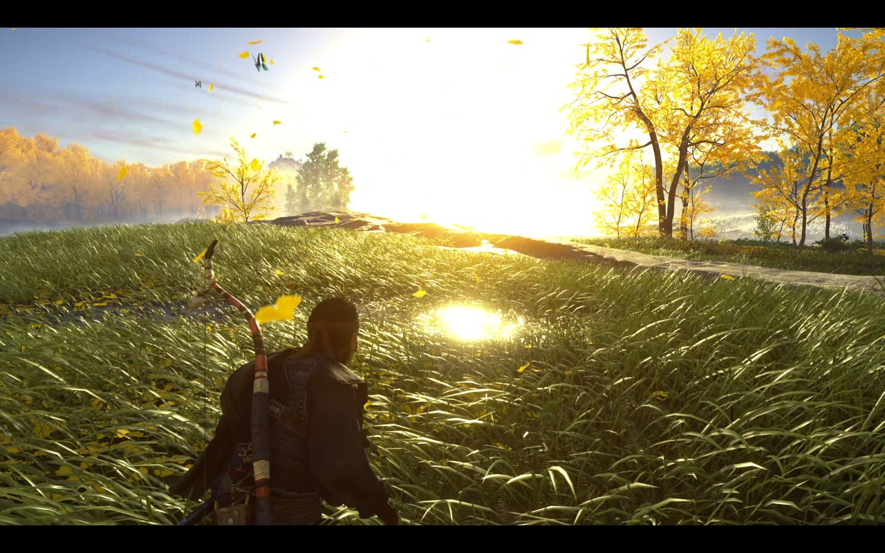
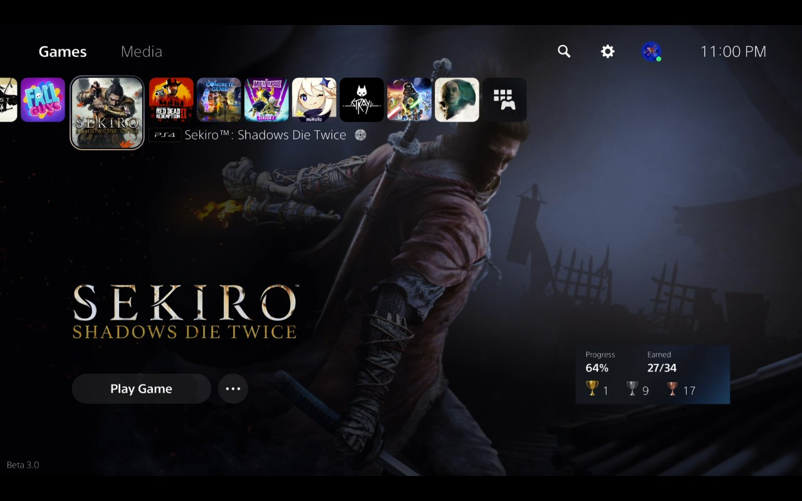
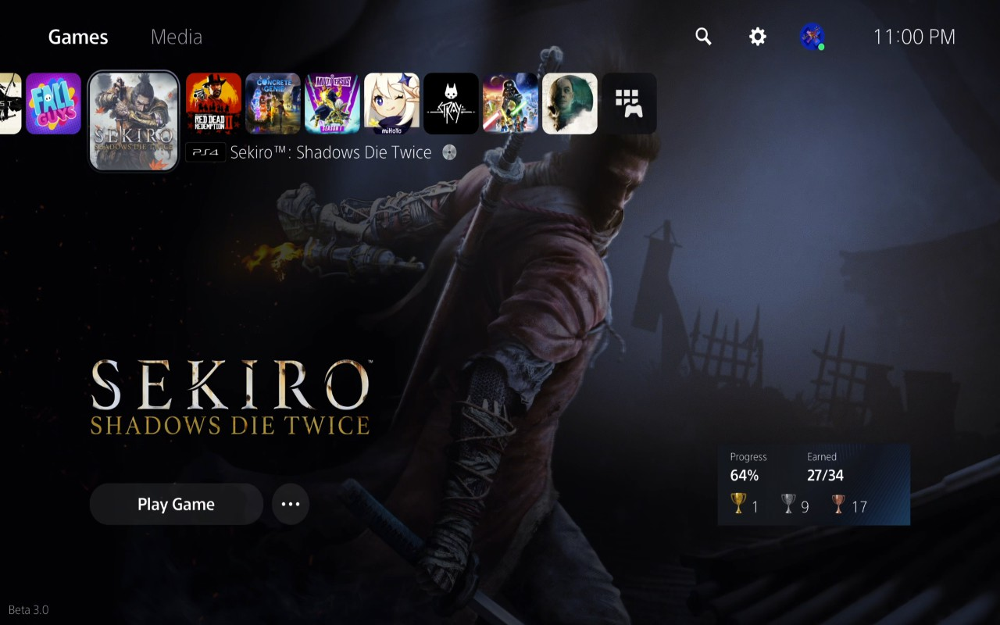

# Completed (Done) Updates

## Remote Connection Via PSN

Enabled remote connection via PSN so users can use this instead of port forwarding on their routers as an option.[^1]

## Touch Friendly and Controller Navigable GUI

QML based user interface that is better suited for handheld computers such as the Steam Deck and more user-friendly in general.[^1]

## HDR for Steam Deck OLED in game mode

You can now use [HDR with your Steam Deck OLED](../setup/configuration.md#hdr-high-dynamic-range) thanks to [Johannes Baiter](https://github.com/jbaiter){target="_blank" rel="noopener"} and [David Rosca](https://github.com/nowrep){target="_blank" rel="noopener"} as well as many patient testers. In order to enable this, you must have:[^1]

1. An HDR-capable streaming device such as the Steam Deck OLED or an OLED monitor attached to an LCD Steam Deck(non-HDR device will still work but use [tonemapping](https://mixinglight.com/color-grading-tutorials/whats-tone-mapping/){target="_blank" rel="noopener"} instead of outputting HDR)

2. A PlayStation 5 console (PlayStation 4 doesn't support H265 streaming)

3. An HDR-capable TV/monitor attached to your Playstation 5 (depending on the connected HDR TV/monitor it may also need to be turned on for the PS5 to output HDR. You can test the PS5 is outputting HDR by going to a game that has HDR settings in the menu such as Cyberpunk 2077 or Ghost of Tsushima and seeing if the game will let you adjust those)

## Enabled Touchpad for Steam Deck Touchscreen and/or Trackpads 

Added Touchpad support for touchscreens (use outer edges of touchscreen for touchpad click) as well as mouse input (enables trackpads to be fully supported with gestures on touch and touchpad click on click). For an example mapping these in a Steam Deck controller profile, see [Default `chiaki4deck` Layout Touchscreen Mapping](../setup/controlling.md#default-chiaki-ng-layout-touchscreen-mapping){target="_blank" rel="noopener"} and [Default `chiaki4deck` Layout Trackpad Mapping](../setup/controlling.md#default-chiaki-ng-layout-trackpad-mapping){target="_blank" rel="noopener"} respectively. Downloading the updated `chiaki4deck+` controller layout will have these mappings set for your convenience.[^1]

## Enabled Gyro for Steam Deck

Added gyro support for Steam Deck via a native interface since SDL2 doesn't support Steam Deck gyro due to Steam's virtual gamepads not providing gyro.[^1]

## Enabled Mic Support

You can now attach a microphone and use it to chat online or use in games. There is also noise suppression and echo cancelling for the mic you can configure in the chiaki4deck settings.[^1]

## Added Steam Shortcut Creation Button

Added ability to create a Steam shortcut with the name of your choice and Chiaki4deck artwork and the Steam Deck controller profile from the main menu. This makes setup even easier on Steam Deck.[^1]

## Enabled Haptics for Steam Deck and DualSense controller + adaptive Triggers for DualSense

Haptics enabled for PlayStation 5 thanks to [Johannes Baiter](https://github.com/jbaiter){target="_blank" rel="noopener"}. You can use a USB connected DualSense for haptics and adaptive triggers or a bluetooth connected DualSense for just adaptive triggers. To use these features for the DualSense in game mode, please disable Steam Input for the DualSense controller following the "Turning off Steam Input" tab in [this section](../setup/controlling.md#enabling-chiaki-ng-to-work-with-dualsense-dualshock-4){target="_blank" rel="noopener"}.[^2].

I have also added the capability to play the haptics via the Steam Deck controller using the native interface I added.

You can also use rumble haptics for controllers without integrated haptics or the Steam Deck if the noise of its haptics bothers you.

## Updated RGB Mapping

RGB mapping update thanks to [Egoistically](https://github.com/Egoistically){target="_blank" rel="noopener"} via a [Chiaki fork](https://github.com/Egoistically/chiaki){target="_blank" rel="noopener"} which is of course copy-left under the [GNU Affero General Public License version 3](https://www.gnu.org/licenses/agpl-3.0.html){target="_blank" rel="noopener"} as are all of the other `chiaki4deck` changes. I added the patches to `chiaki4deck` and it results in a more accurate picture. Joni Bimbashi updated the initial mapping to work with HW acceleration. Below is a **BEFORE** and **AFTER** from Ghost of Tsushima.[^1]

!!! example "BEFORE"

    

!!! example "AFTER"

    

## 3 view modes for non-standard screen sizes

It's great to have these options for Steam Deck's non-standard 1280x800 resolution.[^3]

    1. Adjust the window to a bigger or smaller size with your mouse in `Desktop Mode` (perhaps you want to use `chiaki4deck` as half of your screen in Desktop mode)

        **OR**

    2. Use fullscreen mode by:

        1. Pressing ++f11++ (either directly in `Desktop Mode` or via a controller mapping in `Game Mode`)

            **OR**

        2. Double clicking on the screen in `Desktop Mode`

    Then, you could use stretch and/or zoom accordingly (i.e., ++ctrl+s++ / ++ctrl+z++ or button mapped to them in game mode).

1. Normal (default) [used for fullscreen launch option]

    Maintains aspect ratio, adds black bars to fill unused parts of screen

    

    

2. Zoom using ++ctrl+z++ to toggle

    Maintains aspect ratio, cutting off edges to fill screen

    

    

3. Stretch using ++ctrl+s++ to toggle

    Stretches image (distorting aspect ratio) to fill screen

    

    

## Quit function ++ctrl+q++

Cleanly quits Chiaki, respecting the user's configuration option of either asking to put PlayStation console sleep, putting PlayStation console to sleep without asking, or leaving PlayStation console on.[^3]

!!! Question "What does this do for me?"

    Now, if you hit a back button (or other button) mapped to ++ctrl+q++ on your Steam Deck, your remote play session will shut down cleanly and put your console to sleep automatically if you so choose. This means you no longer have to manually put your console to sleep via a menu or the power button on the PlayStation console itself.

## Enabled Automated Launch and Auto-connect

This skips the need to visit the configuration screen each time. Use auto-connect if you have one console to choose from and this will work out of the box. Otherwise, you can create an automation script to do this for you. I have added a helper script to generate a `Chiaki-launcher.sh` script as well as provided complete instructions in the [Automation section](../setup/automation.md){target="_blank" rel="noopener"}.[^1]

## Enabled Touchpad and Gyro Controls with DualSense/DualShock 4 Controller for Flatpak

This makes it as easy as possible for Steam Deck users to use touchpad and gyro support with their DualSense or DualShock 4 controller. See [Using a DualSense and/or DualShock4 Controller with `chiaki-ng`](../setup/controlling.md#using-a-dualsense-andor-dualshock4-controller-with-chiaki-ng){target="_blank" rel="noopener"} to set it up for yourself.[^3]
The DualSense/DualShock 4 touchpad and gyro controls work with the binary version of Chiaki but don't work with the official flatpak version. Luckily for you, they now work with the `chiaki4deck` flatpak! :smile:

[^1]: merged upstream, but not yet released in official flatpak
[^2]: partially merged upstream
[^3]: now part of upstream Chiaki as of latest release